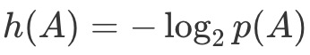
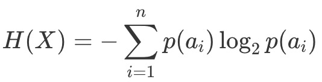
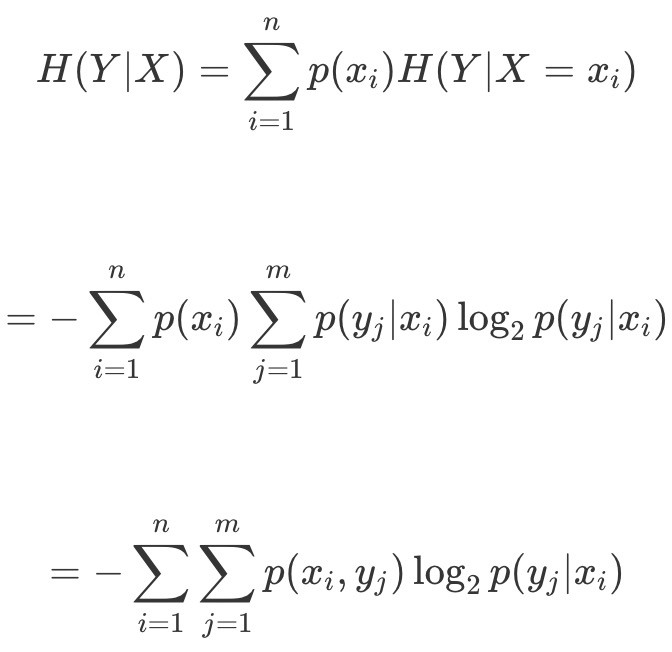
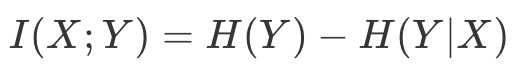
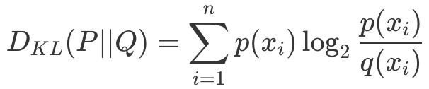

https://time.geekbang.org/column/article/1573

信息论使用“*信息熵*”的概念，对 *单个信源的信息量* 和 *通信中传递信息的数量* 与 *效率* 等问题做出了解释，并在 *世界的不确定性* 和 *信息的可测量性* 之间搭建起一座桥梁。

比如，“中国男子足球队获得世界杯冠军”，这是一个小概率事件（如果不是不可能事件的话），不确定性越大的消息可能性越小，其提供的信息量就越大。

再比如，“中国男子乒乓球队获得世界杯冠军”，由于这是一个大家习以为常的事件，所以信息量就小。

**熵的本质即一个系统内在的混乱程度。**

## 信息量

在信息论中，如果事件 A 发生的概率为 p(A)，则这个事件的自信息量的定义为

比如国足赢的世界杯的概率是1/1000，那么信息量约为10比特。国乒夺冠的概率是1/2，信息量也就只有1比特。

**信源熵**

根据 *单个事件的自信息量* 可以计算 *包含多个符号的信源的信息熵*。

*信源的信息熵* 是 信源 **可能**发出的各个符号的自信息量在信源构成的 *概率空间上的统计平均值*。如果一个离散信源 X 包含 n 个符号，每个符号 ai 的取值为 p(ai)，则 X 的信源熵为

复习[这篇文章][1]。

## 条件熵

将概率论中条件概率扩展到信息论中，就可以得到**条件熵**。

如果两个信源之间具有相关性，那么在已知其中一个信源 X 的条件下，另一个信源 Y 的信源熵就会减小。

条件熵 H(Y∣X) 表示的是在已知随机变量 X 的条件下另一个随机变量 Y 的不确定性，也就是在给定 X 时，根据 Y 的条件概率计算出的熵再对 X 求解数学期望：

**条件熵的意义在于先按照变量 X 的取值对变量 Y 进行了一次分类，对每个分出来的类别计算其单独的信息熵，再将每个类的信息熵按照 X 的分布计算其数学期望。**

以上课为例，学生在教室中可以任意选择座位，那么可能出现的座位分布会很多，其信源熵也就较大。如果对座位的选择添加一个限制条件，比如男生坐左边而女生坐右边，虽然左边的座位分布和右边的座位分布依然是随机的，但相对于未加限制时的情形就会简单很多。**这就是分类带来的不确定性的下降**。

## 互信息/信息增益

定义了条件信息熵后，就可以进一步得到**互信息**的概念

互信息等于 Y 的信源熵减去已知 X 时 Y 的条件熵，即由 X 提供的关于 Y 的不确定性的消除，也可以看成是 X 给 Y 带来的**信息增益**。互信息这个名称在通信领域经常使用，信息增益则在机器学习领域中经常使用，两者的本质是一样的。

复习[这篇文章][2]。

**在机器学习中，信息增益常常被用于分类特征的选择。**

对于给定的训练数据集 Y，H(Y) 表示在未给定任何特征时，对训练集进行分类的不确定性；H(Y∣X) 则表示了使用特征 X 对训练集 Y 进行分类的不确定性。信息增益表示的就是特征 X 带来的对训练集 Y 分类不确定性的减少程度，也就是特征 X 对训练集 Y 的区分度。

**信息增益比**

显然，信息增益更大的特征具有更强的分类能力。但信息增益的值很大程度上依赖于数据集的信息熵 H(Y)，因而并不具有绝对意义。为解决这一问题，研究者又提出了**信息增益比**（复习[这篇文章][3]）的概念，并将其定义为 g(X,Y)=I(X;Y)/H(Y)。

## Kullback-Leibler 散度

简称 **KL 散度**。KL 散度是描述两个概率分布 P 和 Q 之间的差异的一种方法，其定义为：

另一个在机器学习中经常使用的信息论概念叫作**KL 散度是对额外信息量的衡量**。给定一个信源，其符号的概率分布为 P(X)，就可以设计一种针对 P(X) 的最优编码，使得表示该信源所需的平均比特数最少（等于该信源的信源熵）。

可是当信源的符号集合不变，而符合的概率分布变为 Q(X) 时，再用概率分布 P(X) 的最优编码对符合分布 Q(X) 的符号编码，此时编码结果的字符数就会比最优值多一些比特。

KL 散度就是用来衡量这种情况下平均每个字符多用的比特数，也可以表示两个分布之间的距离。

这块还有很多内容，没看懂，就不记笔记了。

## 最大熵原理

除了以上定义的指标之外，信息论中还有一个重要定理，叫作“最大熵原理”。

最大熵原理是确定随机变量统计特性时力图最符合客观情况的一种准则。对于一个未知的概率分布，最坏的情况就是它以 *等可能性* 取到每个可能的取值。这个时候的概率分布最均匀，也就是随机变量的随机程度最高，对它进行预测也就最困难。

这块还有很多内容，没看懂，就不记笔记了。

[1]: /statistics/entropy?id=信息熵entropy
[2]: /statistics/entropy?id=信息增益information-gain
[3]: /statistics/decision-tree?id=c45算法
