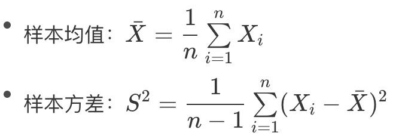
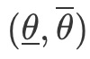

https://time.geekbang.org/column/article/1498

**数理统计（mathematical statistics）**根据观察或实验得到的数据来研究随机现象，并**对研究对象的客观规律做出合理的估计和判断**。

**数理统计**和**概率论**存在方法上的本质区别：

* **概率论**作用的前提是**随机变量的分布已知**，根据已知的分布来分析随机变量的特征与规律；
* **数理统计**的研究对象则是**未知分布的随机变量**，研究方法是对随机变量进行独立重复的观察，根据得到的观察结果对原始分布做出推断。

> 用买彩票打个比方，概率论解决的是根据已知的摇奖规律判断一注号码中奖的可能性。
>
> 数理统计解决的则是根据之前多次中奖 / 不中奖的号码记录以一定的精确性推测摇奖的规律，虽然这种尝试往往无功而返。

## 样本、总体、统计量

**样本（sample）**，在数理统计中，可用的资源是有限的数据集合，这个**有限数据集**被称为样本。

**总体（population）**，观察对象**所有的可能取值**被称为总体。

**数理统计的任务就是根据样本推断总体的数字特征**。样本通常由对总体进行多次独立的重复观测而得到，这保证了不同的样本值之间相互独立，并且都与总体具有相同的分布。

**在统计推断中**，应用的往往不是样本本身，而是**统计量**（**统计量是样本的函数**）。**统计量本身是一个随机变量**，是用来进行统计推断的工具。

**样本均值**和**样本方差**是两个最重要的统计量：

统计推断的基本问题可以分为两大类：*参数估计（estimation theory）*和*假设检验（hypothesis test）*。

## 参数估计

参数估计是通过随机抽取的样本来估计总体分布的方法，又可以进一步划分为*点估计（point estimation）*和*区间估计（interval estimation）*。

**参数估计的对象是总体的某个参数**。

### 点估计

在已知总体分布函数形式，但未知其一个或者多个参数（统计量）时，借助于总体的一个样本来估计未知参数的取值就是参数的点估计。

点估计的核心在于构造合适的统计量 θ^，并用这个统计量的观察值作为未知参数 θ 的近似值。

点估计的具体方法包括*矩估计法*（method of moments）和*最大似然估计法*（maximum likelihood estimation）。

**矩估计法**

矩估计法基于大数定律。

矩表示的是随机变量的分布特征，k 阶矩的定义为随机变量的 k 次方的均值，即 E(Xk)。矩估计法的思想在于用样本的 k 阶矩估计总体的 k 阶矩，其理论依据在于样本矩的函数几乎处处收敛于总体矩的相应函数，这意味着当样本的容量足够大时，几乎每次都可以根据样本参数得到相应总体参数的近似值。

**最大似然估计法**

最大似然估计法源于频率学派看待概率的方式。

**对最大似然估计的直观理解是：既然抽样得到的是已有的样本值，就可以认为取到这一组样本值的概率较大，因而在估计参数 θ 的时候就需要让已有样本值出现的可能性最大。**换句话说就是，只有概率大才会被抽到。

在最大似然估计中，似然函数被定义为样本观测值出现的概率，确定未知参数的准则是让似然函数的取值最大化，也就是微积分中求解函数最大值的问题。由于不同的样本值之间相互独立，**因而似然函数可以写成若干概率质量函数 / 概率密度函数相乘的形式，并进一步转化为对数方程求解**。

对于同一个参数，不同估计方法求出的估计量很可能存在差异，因此要对估计量做一个评价，评价通常要考虑以下三个基本标准：

* **无偏性**：估计量的数学期望等于未知参数的真实值；

  无偏性意味着给定样本值时，根据估计量得到的估计值可能比真实值更大，也可能更小。但如果保持估计量的构造不变，而是进行多次重新抽样，每次都用新的样本计算估计值，那么这些估计值与未知参数真实值的偏差在平均意义上等于 0，这意味着不存在系统误差。

  简单来说就是，估计量的构造没问题，估计量和未知参数真实值的偏差是由样本造成的。

* **有效性**：无偏估计量的方差尽可能小；

  估计值与真实值之间的偏差不可避免，有效性度量的正是估计量和真实值之间的偏离程度。

* **一致性**：当样本容量趋近于无穷时，估计量依概率收敛于未知参数的真实值。

  而偏离程度不仅仅取决于估计量的构造方式，还取决于样本容量的大小，一致性表示的是随着样本容量的增大，估计量的值将稳定在未知参数的真实值上。

### 区间估计

在估计未知参数 θ 的过程中，除了求出估计量，还需要估计出一个区间，并且确定这个区间包含 θ 真实值的可信程度。**在数理统计中，这个区间被称为置信区间（confidence interval），这种估计方式则被称为区间估计**。

区间估计相当于在点估计的基础上进一步提供了取值范围和误差界限，分别对应着*置信区间*和*置信水平*。

**置信区间**：对总体反复抽样多次，每次得到容量相同的样本，则根据每一组样本值都可以确定出一个置信区间

其上界和下界是样本的两个统计量，分别代表了**置信上限**和**置信下限**。

**置信水平**：每个置信区间都存在两种可能性：包含 θ 的真实值或不包含 θ 的真实值。如果对所有置信区间中包含 θ 真实值的比率进行统计，得到的比值就是置信水平。

## 假设检验

**假设检验的对象是关于总体的某个论断，即关于总体的假设。**

假设检验中的假设包含原假设 H0 和备择假设 H1；检验的过程就是根据样本在 H0 和 H1 之间选择一个接受的过程。

要证明原假设 H0 为真，更容易的方法是证明备择假设 H1 为假，因为只要能够举出一个反例就够了。但在假设检验中，反例并非绝对意义上对假设的违背，而是以小概率事件的形式出现。

在数理统计中，发生概率小于 1% 的事件被称作小概率事件，在单次实验中被认为是不可能发生的。

* 如果在一次观测得到的样本中出现了小概率事件，那么就有理由认为这不是真正意义上的小概率事件，原始的假设也就此被推翻。

* 如果是备择假设被推翻，就意味着接受原假设；

从数理统计的角度看，监督学习算法的任务就是在假设空间中搜索能够针对特定问题做出良好预测的假设。学习器通过对测试数据集的学习得到具有普适性的模型，这个模型适用于不属于测试集的新样本的能力被称为泛化能力。显然，泛化能力越强，学习器就越好。

**假设检验的作用就在于根据学习器在测试集上的性能推断其泛化能力的强弱，并确定所得结论的精确程度，可以进一步推广为比较不同学习器的性能**。由于度量学习器性能的常用指标是错误率，假设检验中的假设就是对学习器的泛化错误率的推断，推断的依据就是在测试数据集上的测试错误率。具体的检验方式有很多种，在此不做赘述。

可以复习[A/B测试](/statistics/ab-test)和[方差分析（F检验）](/statistics/anova)。

## 泛化性能解释

除了推断之外，对泛化性能的解释也是机器学习算法分析的重要内容。泛化误差的构成可以分为三部分：

* **偏差（bias）**

  表示算法预测值和真实结果之间的偏离程度，**刻画的是模型的欠拟合特性**。

* **方差（variance）**

  表示数据的扰动对预测性能的影响，**刻画的是模型的过拟合特性**。

* **噪声（noise）**

  表示在当前学习任务上能够达到的最小泛化误差，**刻画的是任务本身的难度**。

**对任何实际的模型来说，偏差和方差都难以实现同时优化，反映出欠拟合与过拟合之间难以调和的矛盾。**

