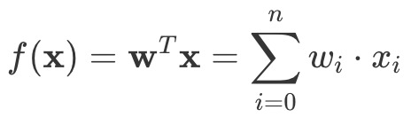
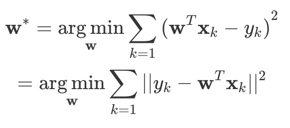
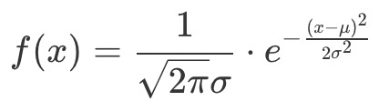
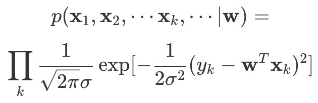
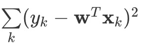
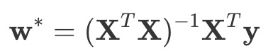
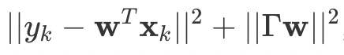
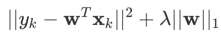

https://time.geekbang.org/column/article/1865

**注意：线性回归的假设是数据和观测值的关系是线性的，但真实世界中并不是所有的数据关系是线性的。**

假定一个实例可以用列向量 <big><strong>x</strong></big>=(x1;x2;⋯,xn) 表示，每个 xi 代表了实例在第 i 个属性上的取值，线性回归的作用就是习得一组参数 wi,i=0,1,⋯,n，使预测输出可以表示为以这组参数为权重的实例属性的线性组合。如果引入常量 x0=1，线性回归试图学习的模型就是

当实例只有一个属性时，输入和输出之间的关系就是二维平面上的一条直线；当实例的属性数目较多时，线性回归得到的就是 n+1 维空间上的一个**超平面**，对应一个维度等于 n 的线性子空间。

## 最小二乘法

在训练集上确定系数 wi 时，预测输出 f(<big><strong>x</strong></big>) 和真实输出 y 之间的误差是关注的核心指标。在线性回归中，这一误差是以**均方误差**来定义的。当线性回归的模型为二维平面上的直线时，均方误差就是预测输出和真实输出之间的**欧几里得距离**，也就是两点间向量的 L2 范数。而以使均方误差取得最小值为目标的模型求解方法就是**最小二乘法**，其表达式可以写成

arg min (下面w) 的意思是，当右侧值最小时，w的取值。

式中每个 <big><strong>x</strong></big>k 代表训练集中的一个样本。**在单变量线性回归任务中，最小二乘法的作用就是找到一条直线，使所有样本到直线的欧式距离之和最小。**

**凭什么使均方误差最小化的参数就是和训练样本匹配的最优模型呢？**

这个问题可以从概率论的角度阐释。线性回归得到的是统计意义上的拟合结果，在单变量的情形下，可能每一个样本点都没有落在求得的直线上。

对这个现象的一种解释是回归结果可以完美匹配理想样本点的分布，但训练中使用的真实样本点是理想样本点和噪声叠加的结果，因而与回归模型之间产生了偏差，而每个样本点上噪声的取值就等于 <big>y</big>k−f(<big><strong>x</strong></big>k)。

假定影响样本点的噪声满足参数为 (0,σ2) 的正态分布，回顾正态分布的概率密度公式：

这意味着噪声等于 0 的概率密度最大，幅度（无论正负）越大的噪声出现的概率越小。在这种情形下，对参数 **w** 的推导就可以用**最大似然的方式**进行，即在已知样本数据及其分布的条件下，找到使样本数据以最大概率出现的假设。

单个样本 <big><strong>x</strong></big>k 出现的概率实际上就是噪声等于 <big>y</big>k−f(<big><strong>x</strong></big>k) 的概率，而相互独立的所有样本同时出现的概率则是每个样本出现概率的乘积，其表达式可以写成（大写Pi代表连续乘积）

而最大似然估计的任务就是让以上表达式的取值最大化。出于计算简便的考虑，上面的乘积式可以通过取对数的方式转化成求和式，且取对数的操作并不会影响其单调性。经过一番运算后，上式的最大化就可以等效为下式的最小化。这不就是最小二乘法的结果么（回看前面）？

因此，**对于单变量线性回归而言，在误差函数服从正态分布的情况下，从几何意义出发的最小二乘法与从概率意义出发的最大似然估计是等价的**。

在单变量线性回归中，其回归方程可以写成 y = w1x + w0。根据最优化理论，将这一表达式代入均方误差的表达式中，并分别对 w1 和 w0 求偏导数，令两个偏导数均等于 0 的取值就是线性回归的最优解。

> 偏导公式略，具体见原文。

单变量线性回归只是一种最简单的特例。当样本的描述涉及多个属性时，这类问题就被称为**多元线性回归**。

多元线性回归中的参数 w 也可以用最小二乘法进行估计，其最优解同样用偏导数确定，但参与运算的元素从向量变成了矩阵。在理想的情况下，多元线性回归的最优参数为

式中的 <big><strong>X</strong></big> 是由所有样本 <big><strong>x</strong></big>=(x0;x1;x2;⋯,xn) 的转置共同构成的矩阵。但这一表达式只在矩阵 (<big><strong>X</strong></big>T<big><strong>X</strong></big>) 的逆矩阵存在时成立。在大量复杂的实际任务中，每个样本中属性的数目甚至会超过训练集中的样本总数，此时求出的最优解 <big><strong>w</strong></big>∗ 就不是唯一的，解的选择将依赖于学习算法的归纳偏好，复习[最小二乘法][1]。

## 过拟合优化

不论采用怎样的选取标准，存在多个最优解都是无法改变的事实，这也意味着过拟合的产生。更重要的是，在过拟合的情形下，*微小扰动给训练数据带来的毫厘之差可能会导致训练出的模型谬以千里，模型的稳定性也就无法保证*。

> 要解决过拟合问题，常见的做法是正则化，即添加额外的惩罚项。

在线性回归中，正则化的方式根据其使用惩罚项的不同可以分为两种，分别是**“岭回归”**和**“LASSO 回归”**。

### 岭回归

在机器学习中，岭回归方法又被称为“参数衰减”，主要目的是解决矩阵求逆的稳定性问题。

岭回归实现正则化的方式是在原始均方误差项的基础上添加一个待求解参数的L2范数项，即最小化的对象变为：

其中的 <big>Γ</big> （就是大写gamma）被称为**季霍诺夫矩阵**，通常可以简化为一个常数。

从最优化的角度看，L2范数惩罚项的作用在于优先选择范数较小的 <big><strong>w</strong></big>，这相当于在最小均方误差之外额外添加了一重关于最优解特性的约束条件，将最优解限制在高维空间内的一个球里。岭回归的作用相当于在原始最小二乘的结果上做了缩放，虽然最优解中每个参数的贡献被削弱了，但参数的数目并没有变少。

### LASSO回归

LASSO 回归的全称是“**最小绝对缩减和选择算子**”（Least Absolute Shrinkage and Selection Operator）。

LASSO 回归选择了待求解参数的L1范数项（回忆一下，就是[曼哈顿距离][2]）作为惩罚项，即最小化的对象变为：

其中的 **λ** 是一个常数。

与岭回归相比，**LASSO 回归的特点在于稀疏性的引入**。它降低了最优解 <big><strong>w</strong></big> 的维度，也就是将一部分参数的贡献削弱为 0，这就使得 <big><strong>w</strong></big> 中元素的数目大大小于原始特征的数目（*这句实际上没看懂*）。

[1]: /linear_algebra/least-squares
[2]: /linear_algebra/vector-space?id=曼哈顿距离（manhattan-distance）
