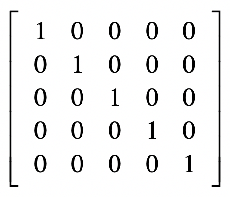

## 标量

之前所谈到的变量都属于**标量**（Scalar），只是一个单独的数字，**不能表示方向**。

## 向量

**向量**（Vector），也可以叫作矢量。加粗的小写字母表示一个向量，例如 **x**，而 **x**1，**x**2，**x**3，…，**x**n 等等，来表示向量中的每个元素，这里面的 **n** 就是向量的维。

把某个向量中的元素看作坐标轴上的坐标，那么这个向量就可以看作空间中的一个点，以原点为起点，以向量代表的点为终点，就能形成一条有向直线。

由于特征有很多维，因此我们可以使用向量来表示某个物体的特征。其中，向量的每个元素就代表一维特征，而元素的值代表了相应特征的值，我们称这类向量为**特征向量（Feature Vector）**。

### 向量加法

两个向量之间的加法，首先它们需要维度相同，然后是对应的元素相加：

二维空间来解释向量相加：

### 向量乘法

向量之间的乘法默认是点乘，向量 x 和 y 的点乘是这么定义的：

点乘的作用是把相乘的两个向量转换成了标量。

## 矩阵

矩阵由多个长度相等的向量组成，其中的每列或者每行就是一个向量。用加粗斜体***<big>X</big>***表示，***<big>X</big>***12，***<big>X</big>***22，***<big>X</big>***nm代表每个元素。n 和 m 分别表示矩阵的行维数和列维数。

### 标量和矩阵相加

只需把标量和矩阵中的每个元素相加即可。

### 标量和矩阵相乘

只需把标量和矩阵中的每个元素相乘即可。

### 矩阵加法

保证两个矩阵行列数相同，对应元素两两相加。

### 矩阵乘法

矩阵 Z 为矩阵 X 和 Y 的乘积，X 的列数 k 必须和 Y 的行数 k 相等，两者才可以进行这样的乘法。

求Z(i,j)的值可以想象为，X(i)行 点乘 Y(j)列：

### 转置（Transposition）

转置是指矩阵内的元素行索引和纵索引互换。例如 Xij 就变为 Xji。

从几何上看就是对角线翻折，注意是45度对角线，不是真的对角线。

### 单位矩阵（Identity Matrix）

单位矩阵（Identity Matrix），所有沿主对角线的元素都是 1，而其他位置的所有元素都是 0，通常我们只考虑单位矩阵为方阵的情况，也就是行数和列数相等，我们把它记做 <big>I</big>n，n 表示维数，比如下面的<big>I</big>5：

### 逆矩阵（Matrix Inversion）

如果有矩阵 X，我们把它的逆矩阵记做 X−1，两者相乘的结果是单位矩阵，写成公式就是这种形式：

