机器学习中两类很重要的方法：回归分析以及线性回归。回归分析属于监督式学习算法，主要研究一个或多个随机变量 y1，y2，…，yi 与另一些变量 x1，x2，…，xk 之间的关系。其中，我们将 y1，y2、…，yi 称为因变量，x1，x2，…，xk 称为自变量。按照不同的维度，我们可以把回归分为三种。

* 按照自变量数量，当自变量 x 的个数大于 1 时就是*多元回归*。
* 按照因变量数量，当因变量 y 个数大于 1 时就是*多重回归*。
* 按照模型种类，如果因变量和自变量为线性关系时，就是*线性回归模型*；如果因变量和自变量为非线性关系时，就是*非线性回归分析模型*。

## 高斯消元法

**一元线性回归：**

对于回归分析来说，最简单的情形一元线性回归，只有一个自变量和一个因变量，且它们大体上是有线性关系的。对应的模型很简单，就是 <big>Y = a + bX + ε</big>。

这里的 X 是自变量，Y 是因变量，a 是截距，b 是自变量的系数，ε表示随机误差，只不过我们通常假定随机误差的均值为 0。

如果我们暂时不考虑 a 和ε，把它扩展为多元的形式，那就是：

**多元线性回归：**

<big>b1⋅x1 + b2⋅x2 + ... + bn−1⋅xn−1 + bn⋅xn = y</big>

假设我们有多个这样的方程，就能构成线性方程组，我这里列出一个例子。

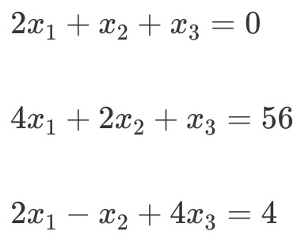

对于上面这个方程组，如果存在至少一组 x1、x2 和 x3 使得三个方程都成立，那么就叫方程有解。

**高斯消元法**

高斯消元法主要分为两步：

* **消元**（Forward Elimination），减少某些方程中元的数量。如果某个方程中的元只剩一个 <big>x</big>m 了，那么这个自变量 <big>x</big>m 的解就能知道了。
* **回代**（Back Substitution），就是把已知的解  <big>x</big>m 代入到方程式中，求出其他未知的解。

*消元*之后的得到：

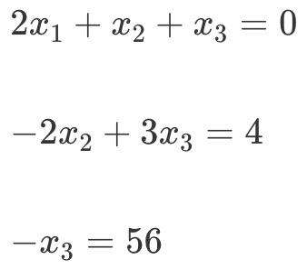

最后我们通过*回代*得到<big>x</big>1<big>= 71</big>、<big>x</big>2<big>= - 86</big>、<big>x</big>3<big>= - 56</big>的解。

整个过程和小学多元一次方程组求解过程没有差别，这里就不赘述了。

## 利用矩阵实现高斯消元

如果方程和元的数量很小，那么高斯消元法并不难理解。可是如果方程和元的数量很多，整个过程就变得比较繁琐了。实际上，我们可以把高斯消元法转为矩阵的操作，便于自己的理解和记忆。

首先我们要把方程中的系数 <big>b</big>i 转成矩阵，我们把这个矩阵记作 B：

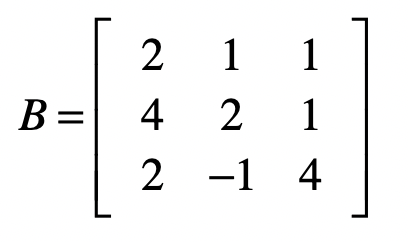

而消元结果把系数矩阵B变为：

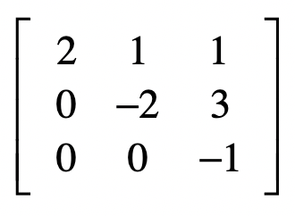

从此可以看出，消元的过程就是把原始的系数矩阵变为*上三角矩阵*。这里的上三角矩阵表示，矩阵中只有主对角线以及主对角线以上的三角部分里有数字。我们用 *U 表示上三角矩阵*。

而回代结果可以看成：

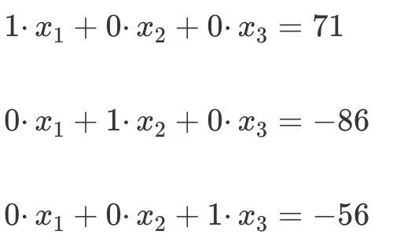

而对应的系数矩阵则是：

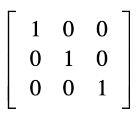

其实就是单位矩阵，所以说回代的过程是把上三角矩阵变为单位矩阵的过程。

总结一下，高斯消元的两步：

* **消元**：把方程组 *系数矩阵B* 转变成 *上三角矩阵U*。
* **回代**：把上 *三角矩阵U* 转变为 *单位矩阵I*。

为了便于后面的回代计算，我们也可以把方程式等号右边的值加入到系数矩阵，我们称这个新的矩阵为**增广矩阵**，我把这个矩阵记为 A。

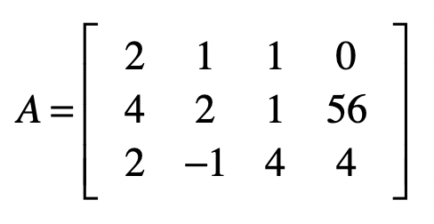

对于这个矩阵，我们的最终目标是，把**除了最后一列之外的部分**，变成单位矩阵，而此时最后一列中的每个值，就是每个自变量所对应的解了。

### 消元过程

* 对于第一个方程式，保持它，让向量 [1,0,0] 左乘 A。
* 对于第二个方程式，让第二个方程式减去第一个方程式的两倍，达到消除 <big>x</big>1 的目的，让向量 [−2,1,0] 左乘 A。
* 对于第三个方程式，让第三个方程式减去第一个方程式，达到消除 <big>x</big>1 的目的，让向量 [−1,0,1] 左乘 A。

> 解读行向量：第 i 个元素代表第 i 个方程式将要乘以的系数，行向量左乘A代表把系数乘以对应的方程式然后相加。

所以把3个行向量组成矩阵E1：

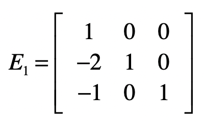

把E1 和 A点乘，实现消除第二个和第三个方程式中 <big>x</big>1 的目的：

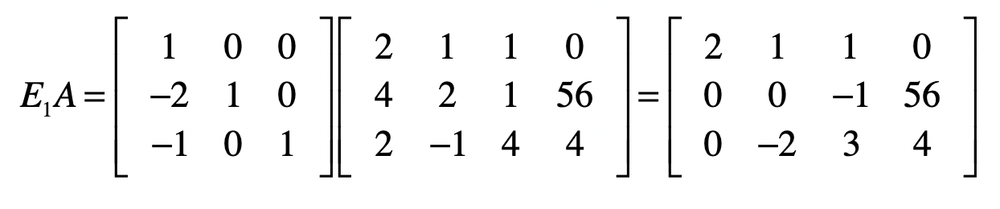

你会发现，由于使用了增广矩阵，矩阵中最右边的一列，也就是方程等号右边的数值也会随之发生改变。

然后我们发现，只要把第二个方程式和第三个方程式互换位置就能够得到上三角矩阵，所以利用E2：

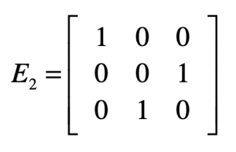

来互换这两行结果，从而得到上三角矩阵：

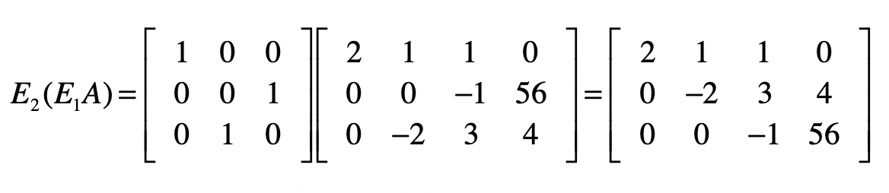

因此把E2左乘E1的结果记作 E3，并把 E3 称为消元矩阵（还记得消元吗？消元的过程就是把原始的系数矩阵变为*上三角矩阵*的过程）：

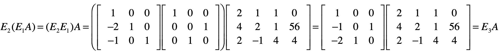

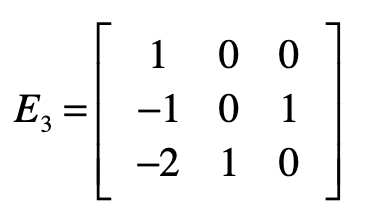

### 回代过程

还记得回代吗？回代就是把上 *三角矩阵U* 转变为 *单位矩阵I*。

上三角矩阵目前是这样的：

和消元不同的是，我们将从第三个方程式开始，只需要把所有系数取反就行了，所以会使用下面这个矩阵 S1 实现：

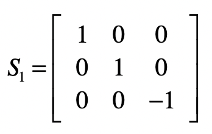

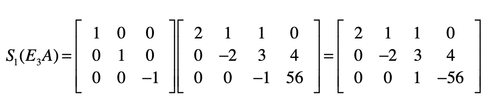

然后从第二个方程式开始，去掉其中的<big>x</big>3，要把第二个方程减去 3 倍的第三个方程：

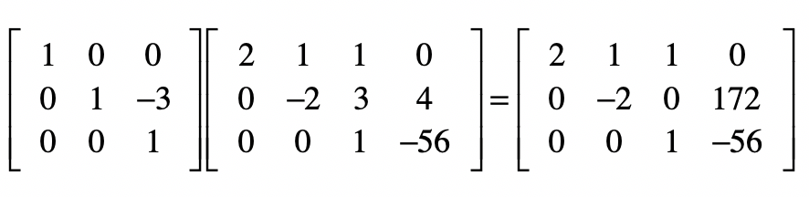

然后把第二个方程除以 -2。

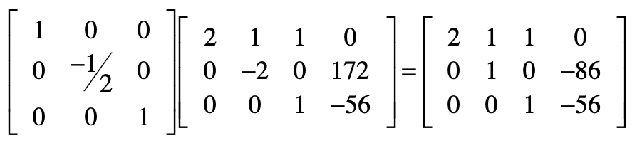

最后，对于第一个方程，我们要把第一个方程减去第二个和第三个方程，最后除以 2，我把这几步合并了，并列在下方：

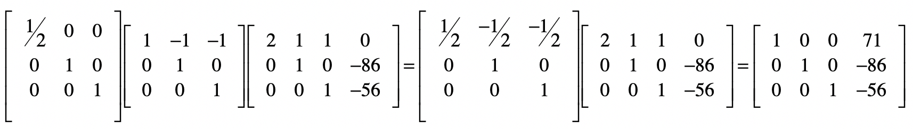

可以看到矩阵已经变成单元矩阵了，而结果矩阵的最后一列就是方程组的解。

### 逆矩阵

把回代部分的矩阵都点乘起来，得到S：

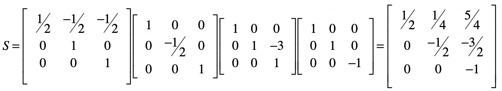

而消元矩阵E3：

让矩阵 S 左乘矩阵 E3得到矩阵SE：

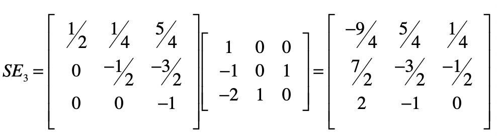

我们把这个矩阵记作 SE，把乘以最初的系数矩阵 B，就得到了一个单位矩阵。根据逆矩阵的定义，SE 就是 B 的逆矩阵。

换个角度来思考，使用消元法进行线性方程组求解的过程，就是在找系数矩阵的逆矩阵的过程。

## python代码

见 notebooks/gaussian-elimination.ipynb

