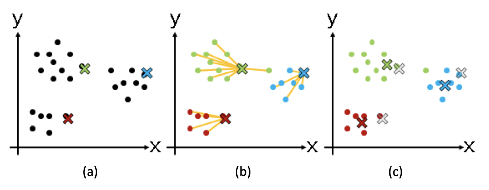
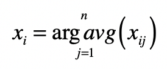

# K-Means聚类算法

不存在任何关于样本的先验知识，而是需要机器在没人指导的情形下，去将很多东西进行归类。由于缺乏训练样本，这种学习被称为“非监督学习”（Unsupervised Learning），也就是我们通常所说的聚类（Clustering）。这种学习体系中，系统必须通过一种有效的方法发现样本的内在相似性，并把数据对象以群组（Cluster）的形式进行划分。

## K 均值（K-Means）聚类算法

**K 均值（K-Means）聚类算法**，它让我们可以在一个任意多的数据上，得到一个事先定好群组数量（K）的聚类结果。

这种算法的中心思想：

* 尽量最大化总的群组内相似度，同时尽量最小化群组之间的相似度。
* 群组内或群组间的相似度，是通过各个成员和群组质心相比较来确定的。

但是在样本数量达到一定规模后，希望通过排列组合所有的群组划分，来找到最大总群组内的相似度几乎是不可能的。于是有了求近似解的方法：

1. 从 N 个数据对象中**随机选取** k 个对象作为质心，这里每个群组的质心定义是，群组内所有成员对象的平均值。因为是第一轮，所以第 i 个群组的质心就是第 i 个对象，而且这时候我们只有这一个组员。
2. 对剩余的对象，测量它和每个质心的相似度，并把它归到最近的质心所属的群组。这里我们可以说距离，也可以说相似度，只是两者呈现反比关系。
3. **重新计算**已经得到的各个群组的质心。这里质心的计算是关键，如果使用特征向量来表示的数据对象，那么最基本的方法是**取群组内成员的特征向量，将它们的平均值作为质心的向量表示**。
4. 迭代上面的第 2 步和第 3 步，直至新的质心与原质心相等或相差之值小于指定阈值，算法结束。

在这张图中：

(a) 步骤是选择初始质心，质心用不同颜色的 x 表示；

( b ) 步骤开始进行聚类，把点分配到最近的质心所在的组；

( c ) 步骤重新计算每个群组的质心，你会发现 x 的位置发生了改变。

之后就是如此重复，进入下一轮聚类。

## 使用向量空间进行聚类

以文本聚类为例，讲如何使用向量空间模型和聚类算法去除重复的新闻。看新闻的，经常会出现热点新闻霸占版面的情况。假如我们不想总是看到重复的新闻，应该怎么办呢？有一种做法就是对新闻进行聚类，那么内容非常类似的文章就会被聚到同一个分组，然后对每个分组我们只选择 1 到 2 篇显示就够了。

第一步，把文档集合都转换成向量的形式，见[tf-idf](linear_algebra/tf-idf)。

第二步，使用 K 均值算法对文档集合进行聚类，有两个点需要关注：

* 使用向量空间中的距离或者夹角余弦度量，计算两个向量的相似度。
* 计算质心的向量，求法非常直观，就是分别为每维分量求平均值：

其中，<big>x</big>i 表示向量的第 i 个分量，<big>x</big>ij 表示第 j 个向量的第 i 个分量，而 j=1,2,…,n 表示属于某个分组的所有向量。

第三步，在每个分类中，选出和质心最接近的几篇文章作为代表。而其他的文章作为冗余的内容过滤掉。

## Python脚本

见仓库 notebooks/k-means.ipynb

## K取值多少合适

在实际项目中，对于一个新的数据集合，K取值多少比较合适呢？如果这个 K 值取得太大，群组可能切分太细，每个组之间区别不大。如果 K 值取得太小，群组的粒度又太粗，造成群组内差异比较明显。对非监督式的学习来说，这个参数确实难以得到准确预估。我们可以事先在一个较小的数据集合上进行尝试，然后根据结果和应用场景确定一个经验值。
