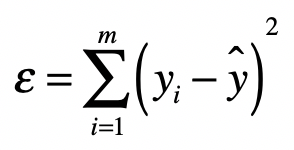

在[前一节][1]里介绍了使用高斯消元法求解线性方程组，这个时候我们并不考虑误差的存在，因此存在无解的可能。而线性回归允许误差ε的存在，我们要做的就是尽量把ε最小化，并控制在一定范围之内。这样我们就可以求方程的近似解。

线性回归分析并不一定需要 100% 精确，而误差ε的存在可以帮助我们降低对精度的要求。通常，多元线性回归会写作：

这里的 x1，x2，…，xn 是自变量，y 是因变量，b0 是截距，b1，b2，…，bn 是自变量的系数，ε 是随机误差。

在线性回归中，为了实现最小化 ε 的目标，我们可以使用最小二乘法进行直线的拟合。最小二乘法通过最小化误差的平方和，来寻找和观测数据匹配的最佳函数。

## 使用观测值拟合

看下面这张图，图中的点是观测值，现在有两条直线，哪条直线最优呢？

既然这样，我们就需要定义哪根线是最优的，以及在给出了最优的定义之后，如何能求解出这条最优的直线呢？最小二乘法可以回答这两个问题。

## 最小二乘法

最小二乘法的主要思想就是求解未知参数，使得理论值与观测值之差（即误差，或者说残差）的平方和达到最小。我们可以使用下面这个公式来描述。

其中，yi 表示来自数据样本的观测值，而 y^ 是假设的函数的理论值，ε 就是我们之前提到的误差，在机器学习中也常被称为损失函数，它是观测值和真实值之差的平方和。

我们就可以写出最小二乘问题的矩阵形式：

其中 B 为系数矩阵，X 为自变量矩阵，Y 为因变量矩阵，换句话说，我们要在向量空间中，找到一个 B，使向量 XB 与 Y 之间欧氏距离的平方数最小的 B。

结合之前所讲的矩阵点乘知识，我们把上述式子改写为：

其中 (XB−Y)′ 表示矩阵 (XB−Y) 的转置，而 tr() 函数表示取对角线上所有元素的和，对于某个矩阵 A 来说，tr(A) 的值计算如下：

进一步，根据矩阵的运算法则，我们有：

因此我们可以得到：

我们知道，求最极值问题直接对应的就是导数为 0（我不知道），因此我对上述的矩阵形式进行求导，得到如下的式子：

我们就能获得 ε 的最小值。从这个条件出发，我们就能求出矩阵 B：

其中 I 为单位矩阵。而 (X’X)−1 表示 X’X 的逆矩阵。所以，最终系数矩阵为：

## 补充证明和解释

为了保持推导的连贯性，在上述的推导过程中，跳过了几个步骤的证明，更多补充证明见[这里][2]。

为什么最终要对矩阵求导数来求ε的最小值？

极值是一个函数的极大值或极小值。如果一个函数在一点的某个邻域内每个地方都有确定的值，而该点所对应的值是最大（小）的，那么这函数在该点的值就是一个极大（小）值。而函数的极值可以通过它的一阶和二阶导数来确定。

对于一元可微函数 f(x)，它在某点 x0 有极值的充分必要条件是：

*  <big>f(x)</big> 在 <big>x</big>0 的邻域上一阶可导，在 <big>x</big>0 处二阶可导。
* 且一阶导数 <big>f'(x</big>0<big>) = 0</big>, <big>f''(x</big>0<big>) != 0</big>，其中 <big>f'</big> 和 <big>f''</big> 分别表示一阶导数和二阶导数。

在一阶导数 <big>f'(x</big>0<big>) = 0</big> 的情况下，如果 <big>f''(x</big>0<big>) < 0</big>，则 <big>f</big> 在 <big>x</big>0 取得极大值；如果 <big>f''(x</big>0<big>) > 0</big>，则 <big>f</big> 在 <big>x</big>0 取得极小值。

这就是为什么在求矩阵 B 的时候，我们要求 2X’XB−2X’Y 为 0，并且 2X’XB−2X’Y 的导数要大于 0，这样我们才能确保求得极小值。

[1]: linear_algebra/gaussian-elimination
[2]: https://time.geekbang.org/column/article/86326
