协同过滤（Collaborative Filtering）是经典的推荐算法之一，它充分利用了用户和物品之间已知的关系，为用户提供新的推荐内容。

## 用矩阵实现推荐系统的核心思想

矩阵中的二维关系，可以表达推荐系统中用户和物品的关系。一个好的推荐算法，需要充分挖掘用户和物品之间的关系。然后推荐给用户“你可能也感兴趣的XX”。

我们用矩阵 X 来表示用户对物品喜好程度：

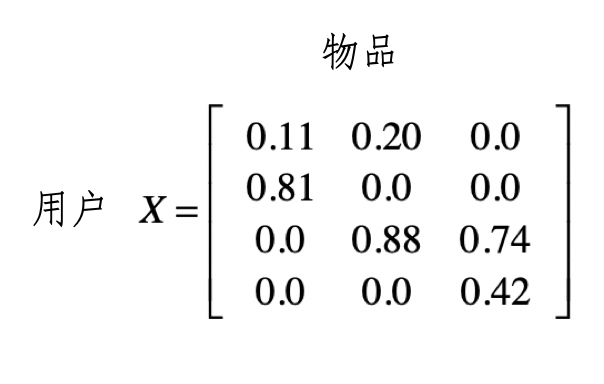

我们用 x_i,j 表示用户i 对 物品j 的喜好程度，这里的喜好程度可以是用户购买商品的次数、对书籍的评分等等。

假设我们用一个 0 到 1 之间的小数表示。有了这种矩阵，我们就可以通过矩阵的操作，充分挖掘用户和物品之间的关系。

**协同过滤**

你可以把它理解为最直观的“口口相传”。其主要思路就是利用已有用户群过去的行为或意见，预测当前用户最可能喜欢哪些东西。根据推荐依据和传播的路径，又可以进一步细分为基于用户的过滤和基于物品的过滤。

## 基于用户的过滤

它是指给定一个用户访问（我们假设有访问就表示有兴趣）物品的数据集合，找出和当前用户历史行为有相似偏好的其他用户，将这些用户组成“近邻”，对于当前用户没有访问过的物品，利用其近邻的访问记录来预测。

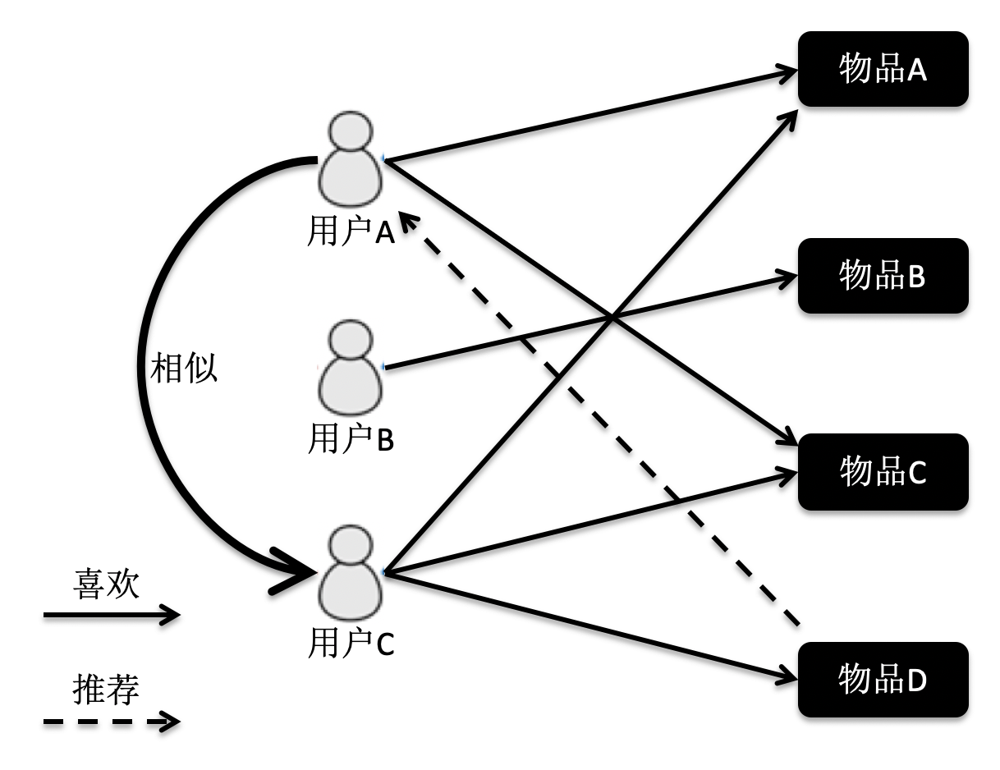

根据这张图的访问关系来看，用户 A 访问了物品 A 和 C，用户 B 访问了物品 B，用户 C 访问了物品 A，C 和 D。我们计算出来，用户 C 是 A 的近邻，而 B 不是。因此系统会更多地向用户 A 推荐用户 C 访问的物品 D。

假设有 m 个用户，n 个物品，使用一个 m×n 维的矩阵 X 来表示用户对物品喜好的二元关系。基于这个二元关系，我们可以列出下面这两个公式：

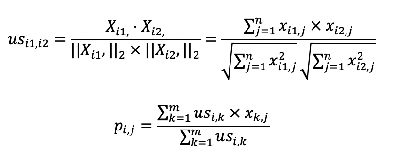

**第一个公式**，计算用户和用户之间的相似度：

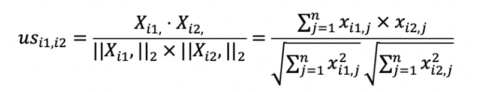

使用了夹角余弦，回顾一下：

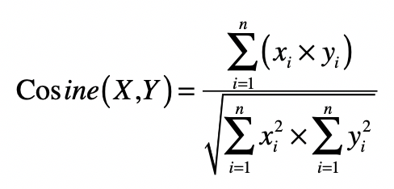

其中 us_i1,i2 表示用户 i1 和 i2 的相似度，而 X_i1, 表示矩阵中第 i1 行的行向量，X_i2, 表示矩阵中第 i2 行的行向量，分子是两个向量的点乘，分母是两个向量的L2范数（向量到原点的欧式距离）的乘积。

**第二个公式**

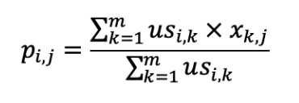

利用第一个公式所计算的用户间相似度，以及用户对物品的喜好度，预测任一个用户对任一个物品的喜好度。其中 p_i,j 表示第 i 用户对第 j 个物品的喜好度，us_i,k 表示用户 i 和 k 之间的相似度，x_k,j 表示用户 k 对物品 j 的喜好度。注意这里最终需要除以 Σus_i,k，是为了进行**归一化**。

从这个公式可以看出，如果 us_i,k 越大，x_k,j 对最终 p_i,j 的影响越大，反之如果 us_i,k 越小，x_k,j 对最终 p_i,j 的影响越小，充分体现了“基于相似用户”的推荐。

### 公式一计算

在夹角余弦公式中，分子是两个向量的点乘，分母是两个向量的欧式距离，即两个向量自己和自己乘的结果。

放到X矩阵中，就是下图这样：

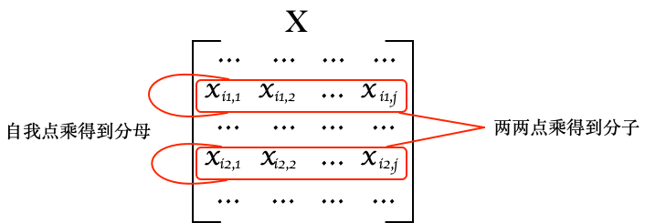

如果我们把X转置得到X'，那么X'的列就是每个用户的列向量，而X的行是每个用户的行向量，两者相乘XX'能够得到矩阵Y：

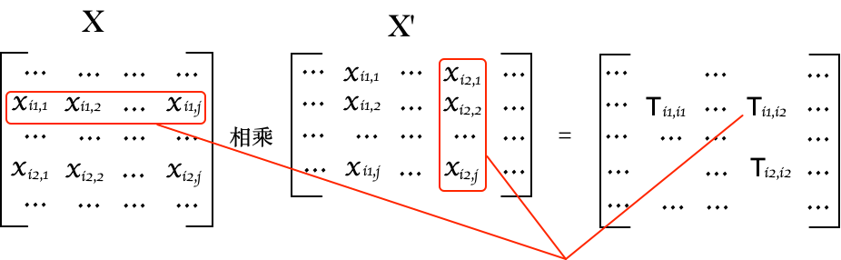

而 y_i,j 就表示用户 i 和用户 j 这两者喜好度向量的点乘结果，即余弦公式分子。而矩阵Y的对角线，就是每个向量用户向量的L2范数，可以用于余弦公式分母。

下面举例说明，先计算Y：

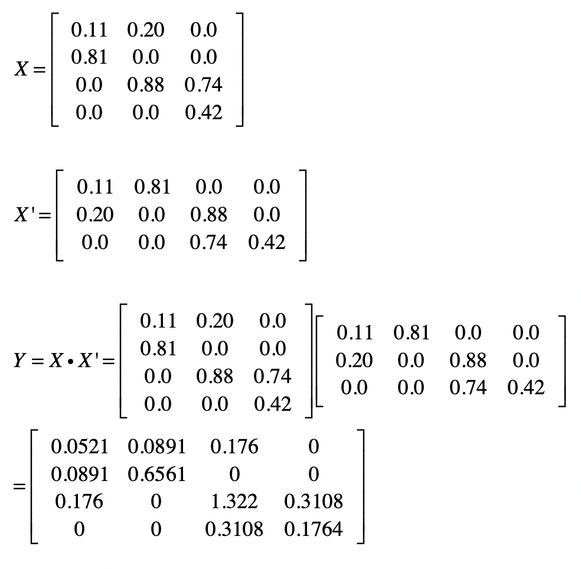

然后我们使用 Y 来计算 US：

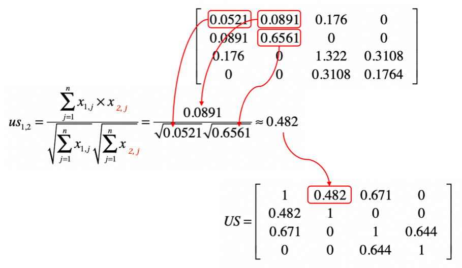

最终，可以到一个m x m维度的用户相似度矩阵US：

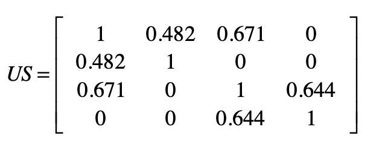

us_i,j 为第 i 个用户与第 j 个用户的相似度，对角线是为1因为每个用户自己和自己的相似度为1，同时这个表格对角线对称的。

### 公式二计算

从矩阵的角度来看，现在已经有用户相似度矩阵 US，用户对物品的喜好度矩阵 X，现在需要计算任意用户对任意物品的喜好度推荐矩阵 P。

分子部分计算，可以使用 US 和 X 的点乘，假设点乘后的结果矩阵为 USP（m x n矩阵），这么算：

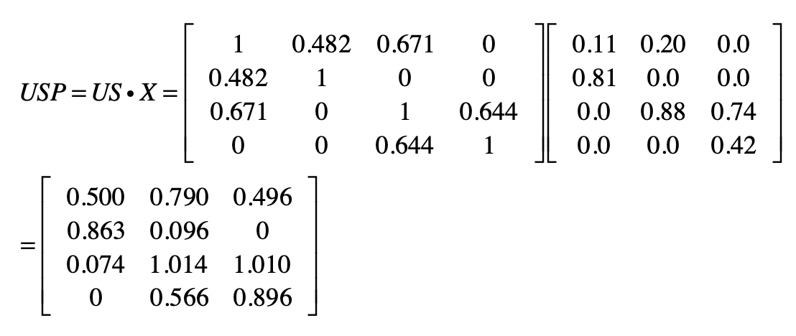

分母部分可以使用 US 矩阵的按行求和来实现。我们假设按行求和的矩阵为 USR。根据示例计算就可以得到 USR，注意，这里把USR 塑形成了 m x n 矩阵：

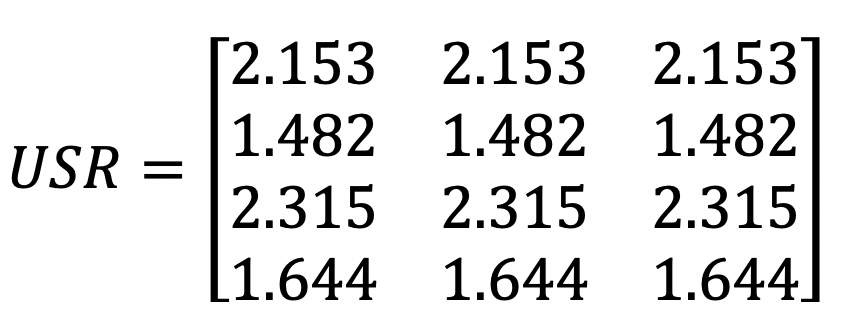

最终，使用 USP 和 USR 的元素**对应除法**，就可以求得矩阵 P：

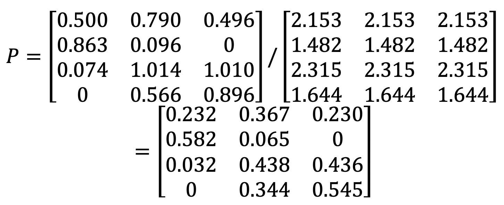

P 是使用推荐算法预测出来的喜好度，X 是已知的喜好度，仔细观察这两个矩阵，值并不相同，不过没关系，不影响我们推荐。在原始矩阵 X 中第 1 个用户对第 3 个物品的喜好度为 0。可是在最终的喜好度推荐矩阵 P 中，第 1 个用户对第 3 个物品的喜好度为 0.278，已经明显大于 0 了，因此我们就可以把物品 3 推荐给用户 1。

### 特征值变换

假设用户的喜好是根据对商品的评分来决定的，有些用户比较宽容，给所有的商品都打了很高的分，而有些用户比较严苛，给所有商品的打分都很低。分数没有可比性，这就会影响相似用户查找的效果，最终影响推荐结果。这个时候可以采用特征值变化，按照用户的维度对用户所有的喜好度进行归一化或者标准化处理，然后再进行基于用户的协同过滤。

## 基于物品的过滤

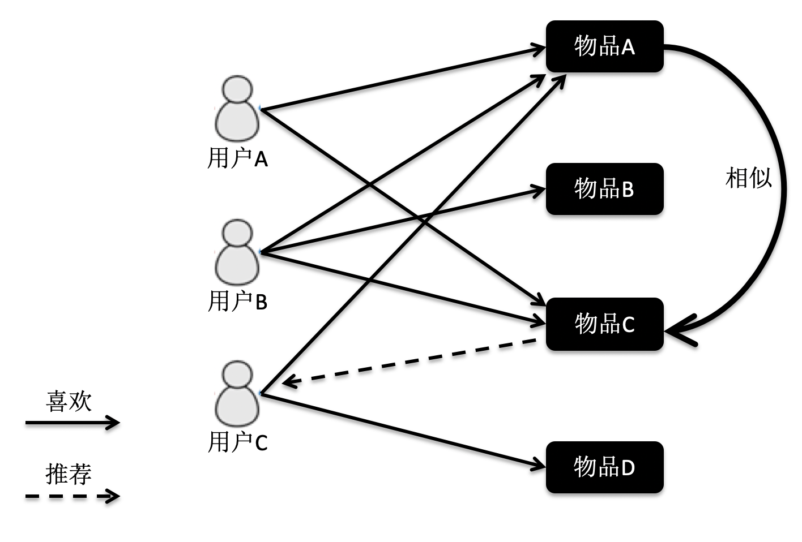

物品 A 和 C 因为都被用户 A 和 B 同时访问，因此它们被认为相似度更高。当用户 C 访问过物品 A 后，系统会更多地向用户推荐物品 C，而不是其他物品。

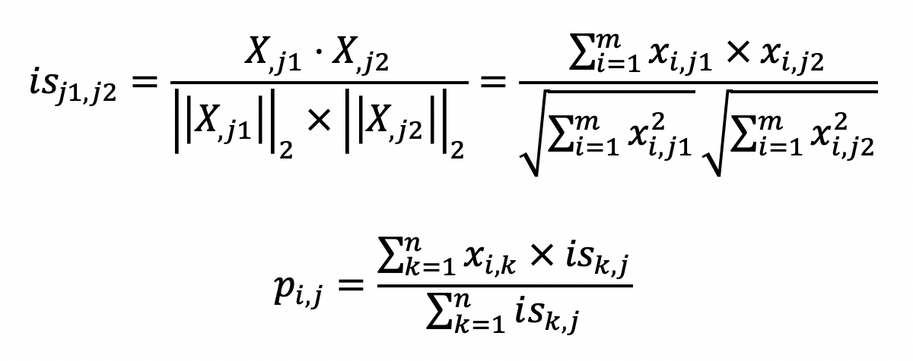

**第一个公式**，计算物品和物品之间的相似度。其中 is_j1,j2 表示物品 j1 和 j2 的相似度，而 X_j1 表示了 X 中第 j1 列的列向量，而 X_j2 表示了 X 中第 j2 列的列向量。分子是两个表示物品的列向量之点乘，而分母是这两个列向量 L2 范数的乘积。

**第二个公式**，利用第一个公式所计算的物品间相似度，和用户对物品的喜好度，预测任一个用户对任一个物品的喜好度。其中 p_i,j 表示第 i 用户对第 j 个物品的喜好度，x_i,k 表示用户 i 对物品 k 的喜好度，is_k,j 表示物品 k 和 j 之间的相似度， Σis_k,j 是为了进行归一化。从这个公式可以看出，如果 is_k,j 越大，x_i,k 对最终 p_i,j 的影响越大，反之如果 is_k,j 越小，x_i,k 对最终 p_i,j 的影响越小，充分体现了“基于相似物品”的推荐。

## python代码

见  notebooks/collab-filter-matrix.ipynb
