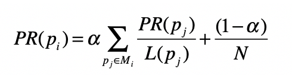
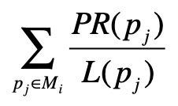
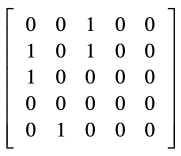
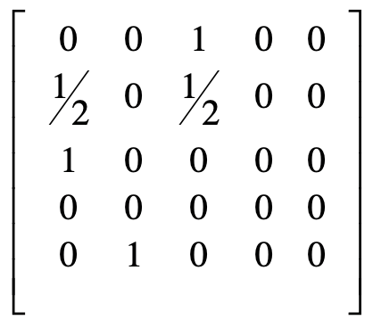
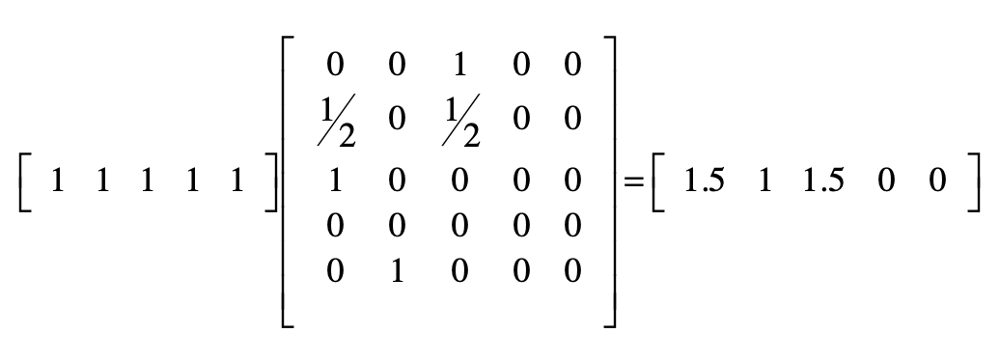
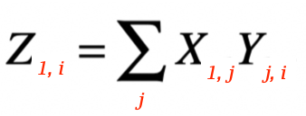
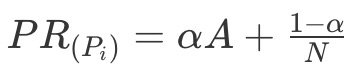
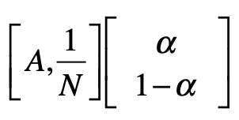
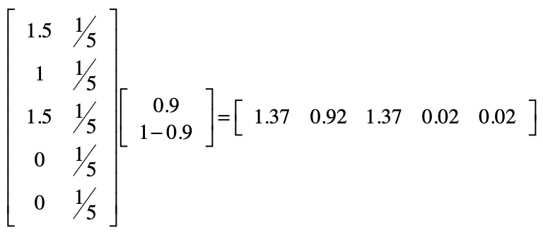

回顾PageRank公式定义：

其中，<big>p</big>i 表示第 i 张网页，<big>M</big>i 是 <big>p</big>i 的入链接集合，<big>p</big>j 是 <big>M</big>i 集合中的第 j 张网页。<big>PR</big>(pj) 表示网页 <big>p</big>j 的 PageRank 得分，<big>L</big>(pj) 表示网页 <big>p</big>j 的出链接数量，1/<big>L</big>(pj) 就表示从网页 <big>p</big>j 跳转到 <big>p</big>i 的概率。<big>α</big> 是用户不进行随机跳转的概率，<big>N</big> 表示所有网页的数量。

PageRank 的计算是采用迭代法实现的：一开始所有网页结点的初始 PageRank 值都可以设置为某个相同的数，例如 1，然后我们通过上面这个公式，得到每个结点新的 PageRank 值。然后再次使用这个公式，循环地修正每个网页结点的值。由于这是一个马尔科夫过程，所以我们能从理论上证明，所有网页的 PageRank 最终会达到一个稳定的数值。

## 简化 PageRank 公式

暂时不考虑随机跳转的情况，而只考虑用户按照网页间链接进行随机冲浪。那么 PageRank 的公式就简化为：

对比矩阵点乘的计算公式：

以上两个公式在形式上是基本一致的。因此，可以把PageRank分解为两个矩阵的点乘。一个矩阵是当前每张网页的 PageRank 得分，另一个矩阵就是邻接矩阵，比如下面：

假设 <big>x</big>i,j 是矩阵中第 i 行、第 j 列的元素，那么我们就可以使用 <big>x</big>i,j 表示从结点 i 到结点 j 的连接，放到 PageRank 的应用场景，<big>x</big>i,j 就表示网页 <big>p</big>i 到网页 <big>p</big>j 的链接。最原始的邻接矩阵所包含的元素是 0 或 1，0 表示没有链接，而 1 表示有链接。那么第 i 行的所有1相加就是网页 <big>p</big>i 的出连接总数。

考虑到PageRank的乘积是 <big>1</big> / <big>L(p</big>j<big>)</big>，其中 j 表示矩阵的第 j 行，所以，我们可以对原始的邻接矩阵，进行基于行的归一化：

有了上述这个邻接矩阵，我们就可以开始最简单的 PageRank 计算。PageRank 的计算是采用迭代法实现的。这里我把初始值都设为 1，并把第一次计算的结果列在这里：

这两个矩阵相乘你可以看成下面公式：

X是所有页面的初始PageRank，Y的含义前面讲过了，因此就能够得到每个页面的第一轮迭代PageRank值。

## 考虑随机跳转

前面已经求得了公式的一部分，把这部分用 <big>A</big>表示，那么公式可以表示成：

可以进一步把上述公式分解成两个矩阵相乘：

用前面例子的结果计算一下，PageRank 值变成了多少，这里 α 取 0.9：

前面提到，PageRank 算法需要迭代式计算。为了避免计算后的数值越来越大甚至溢出，我们可以进行归一化处理，保证所有结点的数值之和为 1。经过这个处理之后，我们得到第一轮的 PageRank 数值，也就是下面这个行向量：

[0.37027027 0.24864865 0.37027027 0.00540541 0.00540541]

接下来，我们只需要再重复之前的步骤，直到每个结点的值趋于稳定就可以了。

## Python代码

见 notebooks/pagerank-matrix.ipynb
