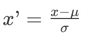

主成分分析 PCA（Principal Component Analysis），是**从矩阵分析的角度**出发，找出数据分布之间的关系，从而达到降低维度的目的，因此并不需要监督式学习中样本标签和特征之间的关系。

## PCA 分析法的主要步骤

1. 标准化样本矩阵中的原始数据；
2. 获取标准化数据的协方差矩阵；
3. 计算**协方差矩阵**的特征值和特征向量；
4. 依照特征值的大小，挑选主要的特征向量；
5. 生成新的特征。

### 1. 标准化原始数据



其中 x 为原始值，u 为均值，σ 为标准差，x’ 是变换后的值。需要注意的是，这里标准化的数据是针对同一种特征，也是在同一个特征维度之内。不同维度的特征不能放在一起进行标准化。

### 2. 获取协方差矩阵

协方差是用于衡量两个变量的总体误差。假设两个变量分别是 x 和 y，而它们的采样数量都是 m，那么协方差的计算公式就是如下这种形式：


其中 xk 表示变量 x 的第 k 个采样数据，xˉ 表示这 k 个采样的平均值。而当两个变量是相同时，协方差就变成了方差。

假设 X,1 表示样本矩阵 X 的第 1 列，X,2 表示样本矩阵 X 的第 2 列，依次类推。而 cov(X,1,X,1) 表示第 1 列向量和自己的协方差，而 cov(X,1,X,2) 表示第 1 列向量和第 2 列向量之间的协方差。结合之前协方差的定义，我们可以得知：


其中，xk,i 表示矩阵中第 k 行，第 i 列的元素。 X,iˉ 表示第 i 列的平均值。

有了这些符号表示，我们就可以生成下面这种**协方差矩阵**。


从协方差的定义可以看出：

* cov(X,i,X,j)=cov(X,j,X,i)，所以 COV 是个对称矩阵。
* 这个对称矩阵的主对角线上的值就是各维特征的方差。

### 3. 计算协方差矩阵的特征值和特征向量

这里所说的矩阵的特征向量，和机器学习中的特征向量（Feature Vector）完全是两回事。

对于一个矩阵 X，如果能找到向量 v 和标量 λ，使得下面这个式子成立。


那么，我们就说 v 是矩阵 X 的特征向量，而 λ 是矩阵 X 的特征值。矩阵的特征向量和特征值可能不止一个。

> 向量 v 左乘一个矩阵 X 看做对 v 进行旋转或拉伸，而这种旋转和拉伸都是由于左乘矩阵 X 后，所产生的“运动”所导致的。

特征向量 v 表示了矩阵 X 运动的方向，特征值 λ 表示了运动的幅度，这两者结合就能描述左乘矩阵 X 所带来的效果，因此被看作矩阵的“特征”。

在 PCA 中的**主成分，就是指特征向量**，而对应的**特征值**的大小，就**表示这个特征向量或者说主成分的重要程度**。特征值越大，重要程度越高。

下面列出了计算特征值的推导过程：


其中 I 是单位矩阵。对于上面推导中的最后一步，我们需要计算**矩阵的行列式**。


最后，通过解这个方程式，**我们就能求得各种λ的解，而这些解就是特征值**。计算完特征值，我们可以把不同的λ值代入 λE−A，来获取特征向量。


### 4. 挑选主要的特征向量，转换原始数据

假设我们获得了 k 个特征值和对应的特征向量，那么我们就有：


按照所对应的λ数值的大小，对这 k 组的 v 排序。排名靠前的 v 就是最重要的特征向量。假设我们只取前 k1 个最重要的特征，那么我们使用这 k1 个特征向量，组成一个 n×k1 维的矩阵 D。

把包含原始数据的 m×n 维矩阵 X 左乘矩阵 D，就能重新获得一个 m×k1 维的矩阵，达到了降维的目的。

有的时候，我们无法确定 k1 取多少合适。一种常见的做法是，看前 k1 个特征值的和占所有特征值总和的百分比。假设一共有 10 个特征值，总和是 100，最大的特征值是 80，那么第一大特征值占整个特征值之和的 80%，我们认为它能表示 80% 的信息量，还不够多。那我们就继续看第二大的特征值，它是 15，前两个特征值之和有 95，占比达到了 95%，如果我们认为足够了，那么就可以只选前两大特征值，把原始数据的特征维度从 10 维降到 2 维。

## python代码

```python
from numpy import *
from numpy import linalg as LA
from sklearn.preprocessing import scale
from sklearn.decomposition import PCA

# 原始数据，包含了3个样本和3个特征，每一行表示一个样本，每一列表示一维特征
x = mat([[1,3,-7],[2,5,-14],[-3,-7,2]])

# 矩阵按列进行标准化
x_s = scale(x, with_mean=True, with_std=True, axis=0)
print("标准化后的矩阵：", x_s)

# 挑选前2个主成分
pca = PCA(n_components=2)

# 进行PCA分析
pca.fit(x_s)

# 输出变换后的数据矩阵。注意，这里的三个值是表示三个样本，而特征从3维变为1维了。
print("方差（特征值）: ", pca.explained_variance_)
print("主成分（特征向量）", pca.components_)
print("变换后的样本矩阵：", pca.transform(x_s))
print("信息量: ", pca.explained_variance_ratio_)
```

更详细见：notebooks/pca.ipynb
