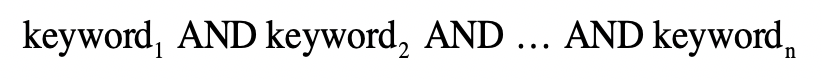
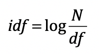
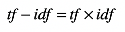

# 文本检索：tf-idf

我们给出一系列关键词，在一堆文档中找到相关文档。最简单的布尔模型，文章中出现关键词就返回真，否则返回假：

复杂一点的则是增加OR条件。但是布尔模型无法告知你这个文章和你查询的相关程度。

布尔模型相比，向量**空间模型**更为复杂，也更为合理，此模型的重点是将文档转换为向量，然后比较向量之间的距离或者相似程度。使用词包（Bag Of Word）的方式把文档转换成向量，同时把用户输入转换成向量，如此一来，相关性问题就转化为计算查询向量和文档向量之间的距离或者相似度了。距离越小或者说相似度越高，那么我们就认为相关度越高。

## 信息检索中的向量空间模型

可以分为四个主要步骤。

第一步，把文档集合都转换成向量的形式。

第二步，把用户输入的查询转换成向量的形式，然后把这个查询的向量和所有文档的向量，进行比对，计算出基于距离或者夹角余弦的相似度。

第三步，根据查询和每个文档的相似度，找出相似度最高的文档，认为它们是和指定查询最相关的。

第四步，评估查询结果的相关性。

## 把文档转为特征向量

先基于词包（Bag of Word）的方式来预处理文本，预处理方式回顾[这里](statistics/nlp-preprocessing)，获得每篇文档出现的单词和词组，对所有文档中的单词和词组进行去重，构建整个文档集合的词典（Vocabulary），向量空间模型把词典中的每个词条作为向量的一个维度。

每个维度的取值：

* 最简单的方法是用“1”表示这个词条出现在文档中，“0”表示没有出现，不过这种方法没有考虑每个词的权重。有些词经常出现，它更能表达文章的主要思想，对于计算机的分析能起到更大的作用。下面两种改进方法
* 或者 词频（tf）
* 或者 词频 x 逆文档频率（tf-idf）

### 词频（tf）

假设我们有一个文档集合 c，d 表示 c 中的一个文档，t 表示一个单词，那么我们使用 tf 表示词频（Term Frequency），也就是一个词 t 在文档 d 中出现的次数。这种方法的假设是，如果某个词在文档中的 tf 越高，那么这个词对于这个文档来说就越重要。

### 词频 x 逆文档频率（tf-idf）

是另一种改进方法，不仅考虑了 tf，还考虑了 idf。这里 idf 表示逆文档频率（Inverse Document Frequency）。

首先，**df** 表示文档频率（Document Frequency），也就是文档集合 c 中出现某个词 t 的文档数量。一般的假设是，某个词 t 在文档集合 c 中，出现在越多的文档中，那么其重要性越低，反之则越高。我们通常用 df 的反比例指标 **idf** 来表示这种重要程度，**idf基本公式**如下：

其中 N 是整个文档集合中文章数量，log 是为了确保 idf 分值不要远远高于 tf 而埋没 tf 的贡献。

这样一来，单词 t 的 df 越低，其 idf 越高，t 的重要性越高。那么综合起来，tf-idf 的基本公式表示如下：

## 查询和文档的匹配

把查询转换成向量，转换的流程是一样的。不过，查询也有它的特殊性，因此需要注意下面几个问题：

* 查询和文档长度不一致。查询通常都很短，甚至都不是一个句子，而只是几个关键词，我们可以使用文档字典中所有的词条来构建向量，如果某维分量所对应的词条出现在文档或者查询中，就取tf-idf 值，如果没有就取 0。这样，文档向量和查询向量的维度就相同了，只是查询向量更稀疏、拥有多维度的 0。
* 查询里出现了文档集合里没有的词。简单的做法是直接去除这维分量，也可以使用相对于其他维度来说极小的一个数值，这和分类中的平滑技术类似。
* 查询里词条的 idf 该如何计算，对于这种情况，我们可以借用文档集合里对应词条的 idf。

把查询转换成向量之后，我们就可以把这个查询的向量和所有文档的向量**依次对比**，看看查询和哪些文档更相似（欧式距离或者夹角余弦）。由于夹角余弦不用进行归一化，所以这种方法更为流行。需要注意的是，信息检索里，夹角余弦的取值范围通常是[0,1]，因为tf-idf使得向量每个分量的取值都是正的。

由于文本向量往往是非常稀疏的，所以后面还可能要做 **[特征选择](statistics/key-feature)**和**[特征值的转换](statistics/normalization-standardization)** 。

## 排序和评估

我们按照和输入查询的相似程度，对所有文档进行相似度由高到低的排序，然后取出前面的若干个文档，作为相关的信息返回。

还需要设计各种离线或者在线的评估，来衡量向量空间模型的效果。

## 优化

假设查询的平均长度（或词条数量）远远小于文档的平均长度，我们把查询的平均长度记做 m，那么对于每次计算查询向量和文档向量的相似度，时间复杂度都是 O(m)。假设文档集中文档的数量平均是 n，那么根据时间复杂度的四则运算法则，把查询和所有文档比较的时间复杂度是 O(m*n)。

可以把倒排索引和向量空间模型相结合。倒排索引可以快速找到包含查询词的候选文档，这样就避免了不必要的向量计算。

