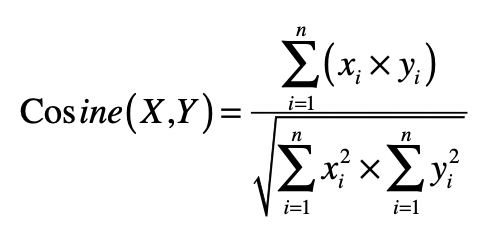

## 向量间距离

距离可以描述不同向量在向量空间中的差异，所以可以用于描述向量所代表的事物之差异（或相似）程度。

### 曼哈顿距离（Manhattan Distance）

在二维空间中，两个点（实际上就是二维向量）x(x1,x2) 与 y(y1,y2) 间的曼哈顿距离是：

推广到 n 维空间，曼哈顿距离的计算公式为：

### 欧氏距离（Euclidean Distance）

在二维空间中，两个点 x(x1,x2) 与 y(y1,y2) 间的欧氏距离是：

推广到 n 维空间，欧氏距离的计算公式为：

### 切比雪夫距离（Chebyshev Distance）

在二维空间中，两个点 x(x1,x2) 与 y(y1,y2) 间的切比雪夫距离是：

推广到 n 维空间，切比雪夫距离的计算公式为：

### 闵可夫斯基距离

闵可夫斯基距离，也叫闵氏距离，在二维空间中，两个点 x(x1,x2) 与 y(y1,y2) 间的闵氏距离是：

两个 n 维变量 x(x1,x2,…,xn) 与 y(y1,y2,…,yn) 间的闵氏距离的定义为：

其中 p 是一个变参数，尝试不同的 p 取值，你就会发现：

* 当 p=1 时，就是曼哈顿距离；

* 当 p=2 时，就是欧氏距离；

* 当 p 趋近于无穷大的时候，就是切比雪夫距离。这是因为当 p 趋近于无穷大的时候，最大的 ∣xi−yi∣ 会占到全部的权重。

## 向量的长度

向量的长度，也叫向量的模，是向量所对应的点到空间原点的距离。通常我们使用欧氏距离来表示向量的长度。

范数常常被用来衡量某个向量空间中向量的大小或者长度：

* L1 范数 ||x|| ，它是为 x 向量各个元素绝对值之和，对应于向量 x 和原点之间的**曼哈顿距离**。
* L2 范数 ||x||2 ，它是 x 向量各个元素平方和的 1/2 次方，对应于向量 x 和原点之间的**欧氏距离**。
* Lp 范数 ||x||p ，为 x 向量各个元素绝对值 p 次方和的 1/p 次方，对应于向量 x 和原点之间的**闵氏距离**。
* L∞ 范数 ||x||∞ ，为 x 向量各个元素绝对值最大那个元素的绝对值，对应于向量 x 和原点之间的**切比雪夫距离**。

## 向量间夹角

计算空间中两个向量所形成夹角的余弦值，具体的计算公式：

分子是两个向量的点乘，分母是两者长度（或 L2 范数）的乘积。

* 夹角余弦的取值范围在[-1,1]。
* 当两个向量的方向重合时夹角余弦取最大值 1，当两个向量的方向完全相反夹角余弦取最小值 -1。
* 值越大，说明夹角越小，两点相距就越近。
* 值越小，说明夹角越大，两点相距就越远。

## 向量空间模型

向量空间模型（Vector Space Model）假设所有的对象都可以转化为向量，然后使用向量间的距离（通常是欧氏距离）或者是向量间的夹角余弦来表示两个对象之间的相似程度。如下图：

* 夹角余弦的取值范围已经在 -1 到 1 之间，而且越大表示越相似。
* 欧氏距离 ED 的取值范围可能很大，而且和相似度呈现反比关系，所以通常要进行 1/(ED+1) 这种归一化（**欧式距离需要归一化**）。
  * 当 ED 为 0 的时候，变化后的值就是 1，表示相似度为 1，完全相同。当 ED 趋向于无穷大的时候，变化后的值就是 0，表示相似度为 0，完全不同。所以，这个变化后的值，取值范围是 0 到 1 之间，而且和相似度呈现正比关系。

## 运用向量空间模型机器学习算法

### K 近邻（KNN）分类

TODO

### K 均值（K-Means) 聚类

TODO
