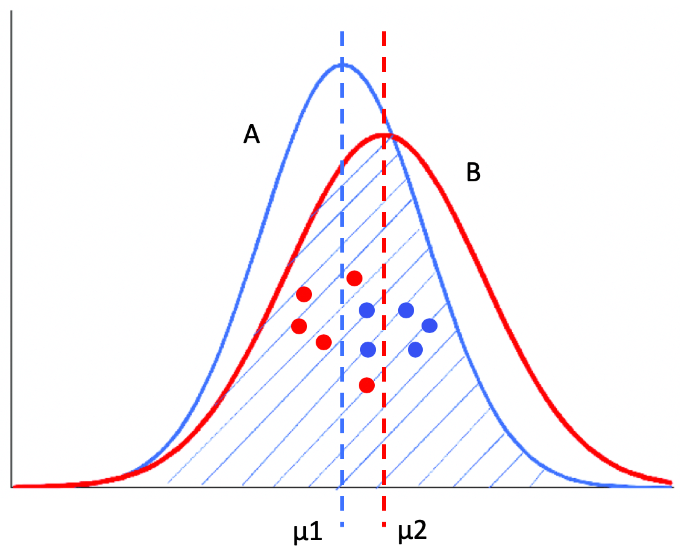

# A/B测试及基本概念

回顾[一文搞懂“正态分布”所有需要的知识点](https://zhuanlan.zhihu.com/p/128809461)。

A/B 测试，简单来说，就是为同一个目标制定两个或多个方案，让一部分用户使用 A 方案，另一部分用户使用 B 方案，记录下每个部分用户的使用情况，看哪个方案产生的结果更好。这也意味着，通过 A/B 测试的方式，我们可以拿到使用多个不同方法之后所产生的多组结果，用于对比。

A/B 测试面临一个问题，就是我们所得到的在线测试结果，实际上只是一种采样，因为采样不均匀可能导致你得到错误的结论，比如下面这张图。如果我们得到A和B的全部数据，那么 B的均值 > A的均值，但是因为采样（看图中的点）的关系不能完全体现整体的数据分布，会得出相反结论：

所以我们不能简单地根据每个组的平均值，来判断哪个组更优。

## 显著性差异

在统计学中，把  A组 分布的均值小于 B组 分布，且A组 和 B组 的方差一致的情况，称为A组 和 B组具有**显著性差异（Significant Difference）**。

所以显著性差异就是研究多组数据之间的差异，是由于不同的数据分布导致的，还是由于采样的误差导致的。通常，我们也把“具有显著性差异”，称为“差异具有统计意义”或者“差异具有显著性”。

需要注意**“差异具有显著性”**和**“具有显著差异”**（少一个“性”字）的区别，前者指两组数据来来自不同的数据分布，后者指的是差异幅度很大，比如100倍。

不过，**“差异具有显著性”**和**“具有显著差异”**没有必然联系。举两个例子：

* 两个不同的数据分布，它们的均值分别是 1 和 1.2，这两个均值相差的绝对值很小，也就是**没有显著差异**，但是由于它们源自不同的数据分布，所以**差异是具有显著性**的。
* 来自同一个数据分布的两个采样，它们的均值分别是 1 和 100，**具有显著的差异**，但是**差异没有显著性**。

## 统计假设检验

**统计假设检验**是指事先对随机变量的参数或总体分布做出一个假设，然后利用样本信息来判断这个假设是否合理。

在统计学上，我们称这种假设为**虚无假设**（Null Hypothesis），也叫原假设或零假设，通常记作 **H0**。而和虚无假设对立的假设，我们称为**对立假设**（Alternative Hypothesis），通常记作 **H1**。也就是说，如果证明虚无假设不成立，那么就可以推出对立假设成立。

统计假设检验的具体步骤：

1. 先认为原假设成立，计算其会导致什么结果。
2. 若在单次实验中产生了小概率的事件，则拒绝原假设 H0，并接受对立假设 H1。
3. 若不会产生小概率的事件，则不能拒绝原假设 H0，从而接受它。

通常我们把概率不超过 0.05 的事件称为“小概率事件”。根据具体的应用，偶尔也会取 0.1 或 0.01 等。在假设检验中，我们把这个概率记为**α**，并称它为**显著性水平**。

## 显著性检验

**显著性检验是统计假设检验的一种**，用来判断多组数据之间的差异，是采样导致的“偶然”，还是由于不同的数据分布导致的“必然“。当然，这里的“偶然”和“必然”都是相对的，和显著性水平α有关。

**显著性检验的H0假设是，多个数据分布之间没有差异。**

如果样本发生的概率小于**显著性水平α**，证明小概率事件发生了，所以拒绝H0假设，也就是说认为多个分布之间有差异。否则呢，接受原假设，认为多个分布之间没有差异。换句话说，**显著性水平α**即为拒绝原假设的标准。

## P值

我们可以使用 P 值（P-value）为多组数据计算它们之间差异的显著性。

P 值中的 P 代表 Probability，就是当 H0 假设为真时，样本出现的概率，或者换句话说，其实就是我们所观测到的样本数据符合原假设 H0 的可能性有多大。

如果 P 值很小，说明观测值与假设 H0 的期望值有很大的偏离，H0 发生的概率很小，我们有理由拒绝原假设，并接受对立假设。P 值越小，表明结果越显著，我们越有信心拒绝原假设。反之，说明观测值与假设 H0 的期望值很接近，我们没有理由拒绝 H0。

只要能计算出 P 值，我们就能把 P 值和显著性水平α进行比较，从而决定是否接受H0。

