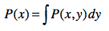

## 随机变量

随机变量（Random Variable）来描述事件所有可能出现的状态，并使用概率分布（Probability Distribution）来描述每个状态出现的可能性。

可分为：

* 离散型随机变量（Discrete Random Variable），​是/不是，黑/白，娱乐行文/国际新闻
* 连续型随机变量（Continuous Random Variable），0～10之间的数字

## 期望值

定义：各种情况出现的概率的总和。如果我们把每种结果的概率看作权重，那么期望值就是所有结果的加权平均值。

满足使用条件概率的条件：

* 在这个问题中可能出现不同的情况，而且各种情况的出现满足了一定的概率分布；
* 每种情况都对应一个数值，这个数值代表了具体的应用含义。

对于离散分布，可以使用加权平均计算。

对于连续分布，使用积分公式：

## 联合概率、条件概率和边缘概率

**联合概率**

P(x, y)，x和y同时发生的概率。

联合概率是条件概率和概率的乘积（贝叶斯公式）：

同样：

**条件概率**

P(x | y)，在y已经确定的情况下，x发生的概率。

**边缘概率**

* 离散型随机变量：对联合概率P(x,y)在y上求和，得到边缘概率P(x)

* 连续型随机变量：求联合概率P(x,y)在y上的积分，得到边缘概率P(x)

## 贝叶斯定理

因为存在联合概率公式：

而P(x, y) = P(y, x)，所以就有：

这个公式里包含，注意此时 y 是固定的：

* 先验概率（Prior Probability），就是P(x) 先验概率，根据已有数据统计出来的。
* 似然函数（Likelihood），P(y | x) 是给定 x 之后 y 出现的条件概率。
* 边缘概率（Marginal Probability），P(y) 不必事先知道，可以对联合概率 P(y, x)在x上求和得到，而P(y, x) 可以通过 P(y|x) * P(x) 推出，然后对离散型和连续型变量的求和公式：

* 后验概率（Posterior Probability），根据前三者推算出来，P(x|y)就是后验概率。

###  随机变量之间的独立性

变量独立的意思是，不论给定y是什么情况，P(x)值保持不变：

或者不论给定x是什么情况，P(y)值保持不变：

如果变量间独立，那么带入到贝叶斯公式中：

就能得到：

如果随机变量独立，那么当遇到求p(x1, x2, x3, x4, x5, x6)的时候，就能够简化为求p(x1) * p(x2) * p(x3) * p(x4) * p(x5) * p(x6)。

实际项目中，我们会假设多个随机变量是相互独立的，虽然这个假设通常是不成立的，但是仍然可以帮助我们得到近似的解。
