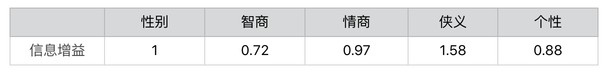
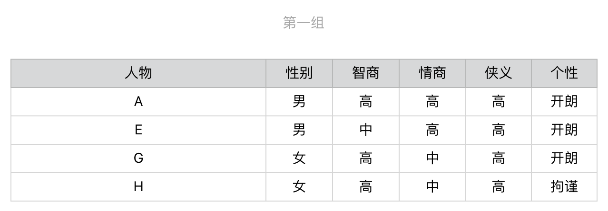
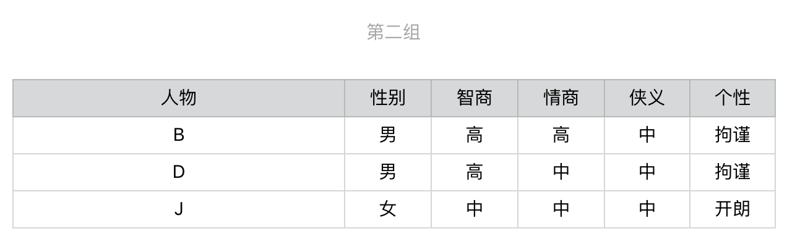
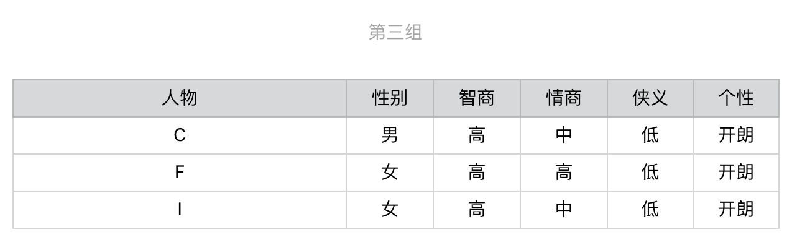
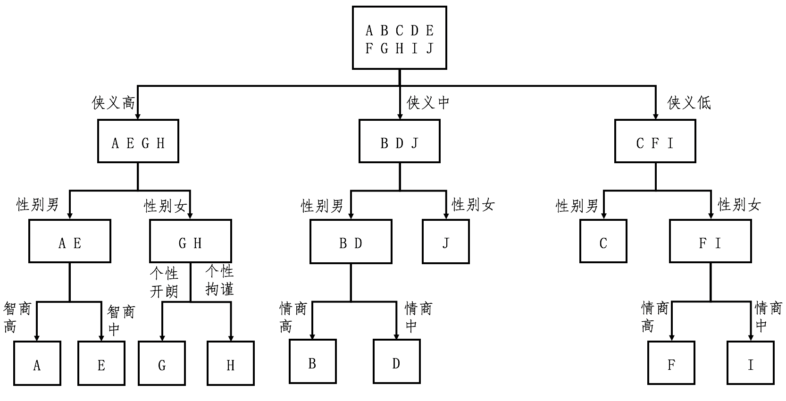
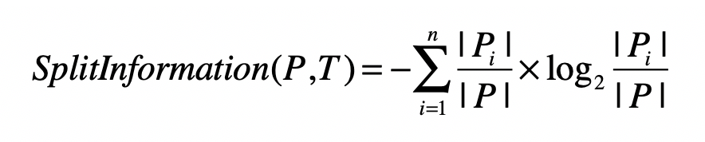
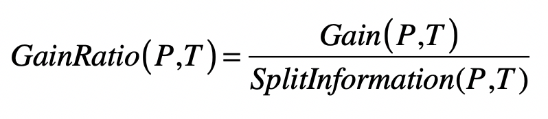
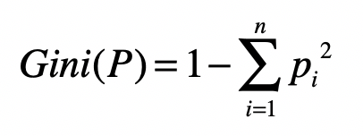
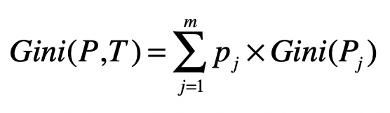

# 决策树: ID3, C4.5, CART

上一节问卷调查的案例解释了**信息熵**和**信息增益**的概念。被测者们每次回答一道问题，就会被细分到不同的集合，每个细分的集合纯净度就会提高，而熵就会下降。在测试结束的时候，如果所有被测者都被分配到了相应的武侠人物名下，那么每个人物分组都是最纯净的，熵值都为 0。于是，测试问卷的过程就转化为“如何将熵从 3.32 下降到 0”的过程。

## 如何通过信息熵挑选合适的问题？

你也许很自然地就想到，**每次**选择问题的时候，选择信息增益最高的问题，这样熵值下降得就最快（注意关键词**每次**，是指针对划分后的每个小集合计算信息增益）。

首先，依次计算“性别”“智商”“情商”“侠义”和“个性”对人物进行划分后的信息增益。我们得到如下结果：

显然，第一步我们会选择“侠义”，之后用户就会被细分为 3 组。

针对第一组，继续选择在**当前这组**中信息增益最高的问题，计算之后选择“性别”，后续步骤以此类推，直到所有人物都被分开，对于其他组也是这么个操作：

注意图中第一个问题是“狭义”，第二个问题是“性别”，第三个问题是“智商”、“个性”、“情商”。

从这个图可以看出来，对于每种人物的判断，我们至多需要问 3 个问题，没有必要问全 5 个问题。比如，对于人物 J 和 C，我们只需要问 2 个问题。假设读者属于 10 种武侠人物的概率是均等的，那么计算读者需要回答的问题数量之期望值。每种人物出现的概率是 0.1，8 种人物需要问 3 个问题，2 种人物需要问 2 个问题，那么回答问题数的期望值是 0.8 * 3 + 0.2 * 2 = 2.8（题）。

总结步骤：

* 第一步，根据分组中的人物类型，为每个集合计算信息熵，并通过全部集合的熵值加权平均，获得整个数据集的熵。注意，一开始集合只有一个，并且包含了所有的武侠人物。
* 第二步，根据信息增益，计算每个问卷题的区分能力。挑选区分能力最强的题目，并对每个集合进行更细的划分。
* 第三步，有了新的划分之后，回到第一步，重复第一和第二步，直到没有更多的问卷题，或者所有的人物类型都已经被区分开来。这一步也体现了递归的思想。

## 决策树

决策树(Decision Tree)学习属于归纳推理算法之一，适用于分类问题。

决定问卷题出现顺序的这个过程，其实就是建立决策树模型的过程。

### ID3算法

其实上述例子总结一下ID3(Iterative Dichotomiser 3 迭代二叉树 3 代)算法（一种训练决策树的算法）过程：

* 第一步，根据集合中的样本分类，为每个集合计算信息熵，并通过全部集合的熵值加权平均，获得整个数据集的熵。注意，一开始集合只有一个，并且包含了所有的样本。
* 第二步，根据信息增益，计算每个特征的区分能力。挑选区分能力最强的特征，并对每个集合进行更细的划分。
* 第三步，有了新的划分之后，回到第一步，重复第一步和第二步，直到没有更多的特征，或者所有的样本都已经被分好类。

在泛化的机器学习问题中，每个类型对应了多个样本，因为这个原因，决策树通常都只能把整体的熵降低到一个比较低的值，而无法完全降到 0，也意味着，训练得到的决策树模型，常常无法完全准确地划分训练样本，只能求到一个近似的解。

算法缺点：

它一般会优先考虑具有较多取值的特征，因为取值多的特征会有相对较大的信息增益，**很容易导致机器学习中的过拟合现象**，不利于决策树对新数据的预测。

### C4.5算法

使用信息**增益率**（Information Gain Ratio）来替代信息增益，作为选择特征的标准，并降低决策树过拟合的程度。

信息**增益率**通过引入一个被称作**分裂信息**（Split Information）的项来惩罚取值较多的特征：

其中，训练数据集 <big>P</big> 通过属性 <big>T</big> 的属性值，划分为 n 个子数据集，|<big>P</big>i| 表示第 i 个子数据集中样本的数量，|<big>P</big>| 表示划分之前数据集中样本总数量。如果某个特征取值很多，那么相对应的子集数量就越多，最终分裂信息的值就会越大。

下面是增益率公式：

### CART算法

CART(Classification and Regression Trees, 分类与回归树)算法和 ID3、C4.5 相比，主要有两处不同：

* 在分类时，CART 不再采用信息增益或信息增益率，而是采用**基尼指数（Gini）**来选择最好的特征并进行数据的划分；
* 在 ID3 和 C4.5 决策树中，算法根据特征的属性值划分数据，可能会划分出多个组。而 CART 算法采用了二叉树，每次把数据切成两份，分别进入左子树、右子树。

CART 算法和 ID3、C4.5 也有类似的地方。

首先，CART 中每一次迭代都会降低**基尼指数**，这类似于 ID3、C4.5 降低信息熵的过程，基尼指数公式：

其中，n 为集合 <big>P</big> 中所包含的不同分组（或分类）数量，<big>p</big>i 表示属于第 i 个分组的元素在集合中出现的概率。**如果集合 P 中所包含的不同分组越多，那么这个集合的基尼指数越高，纯度越低。**

然后，我们需要计算整个数据集的基尼指数：

m 为全集使用特征 <big>T</big> 划分后，所形成的子集数量，<big>P</big>j 为第 j 个集合，<big>p</big>j代表第j个集合出现的概率。

## 决策树优化

决策树算法比较容易过拟合，过拟合问题产生的主要原因则是特征维度过多，导致拟合的模型过于完美地符合训练样本，但是无法适应测试样本或者说新的数据。

可以使用剪枝和随机森林来缓解这个问题。

### 剪枝

就是删掉决策树中一些不是很重要的结点及对应的边，这其实就是在减少特征对模型的影响。虽然去掉一些结点和边之后，决策树对训练样本的区分能力变弱，但是可以更好地应对新数据的变化，具有更好的泛化能力。至于去掉哪些结点和边，我们可以使用[特征选择方法](statistics/key-feature)来进行。

更多剪枝方法 TODO

### 随机森林

随机森林的构建过程更为复杂一些。“森林”表示有很多决策树。随机森林算法采用了统计里常用的可重复采样法，每次从全部 n 个样本中取出 m 个（m<n），然后构建一个决策树。重复这种采样并构建决策树的过程若干次，我们就能获得多个决策树。对于新的数据，每个决策树都会有自己的判断结果，我们取大多数决策树的意见作为最终结果。由于每次采样都是不完整的训练集合，而且有一定的随机性，所以每个决策树的过拟合程度都会降低。

更多资料 TODO

## 总结

决策树算法的优势在于，容易理解和实现。此外，对于通过样本训练所得的树结构，其每个结点都是基于某个数据特征的判定，对于我们的阅读和解释来说都是很方便的。

决策树也有不足。之前我已经提到，这类算法受训练样本的影响很大，比较容易过拟合。在预测阶段，如果新的数据和原来的训练样本差异较大，那么分类效果就会比较差。为此人们也提出了一些优化方案，比如剪枝和随机森林。

| 算法 | 树结构 |  支持模型  |       特征选择       | 连续值处理 | 缺失值处理 |  剪枝  |
| :--: | :----: | :--------: | :------------------: | :--------: | :--------: | :----: |
| ID3  | 多叉树 |    分类    |       信息增益       |   不支持   |   不支持   | 不支持 |
| C4.5 | 多叉树 |    分类    |      信息增益率      |    支持    |    支持    |  支持  |
| CART | 二叉树 | 分类、回归 | 基尼指数、平方误差和 |    支持    |    支持    |  支持  |

## 扩展阅读

* [决策树算法--ID3算法](https://zhuanlan.zhihu.com/p/133846252)
* [决策树算法--C4.5算法](https://zhuanlan.zhihu.com/p/139188759)
* [决策树算法--CART分类树算法](https://zhuanlan.zhihu.com/p/139523931)
