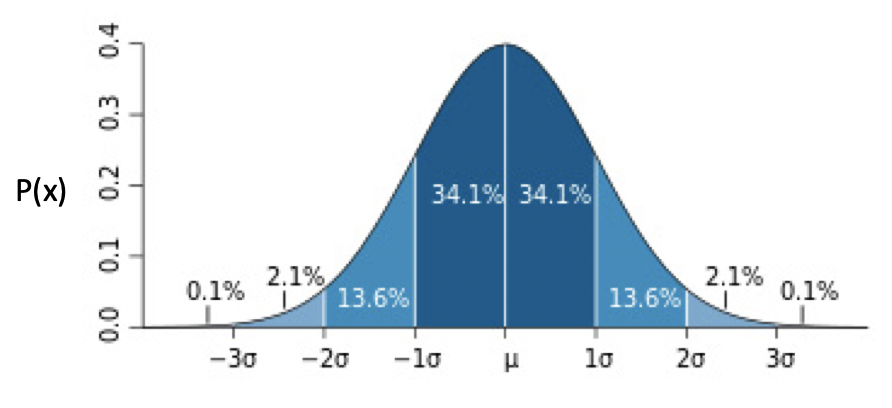

# 概率分布

定义：用来描述随机变量每个状态出现的可能性

## 离散分布

### 伯努利分布

Bernoulli Distribution。

单个随机变量的分布，而且这个变量的取值只有两个，0 或 1。

公式：

或者：

其中 x 只能为 0 或 1。

### 分类分布

Categorical Distribution / Multinoulli Distribution。

定义：描述了一个具有 k 个不同状态的单个随机变量。k是有限的数值，k为2是就是伯努利分布。

公式：

图：

### 二项分布

TODO

### 泊松分布

TODO

## 连续值分布

离散型随机变量的状态数量是有限的，对于连续型随机变量来说，状态是无穷多的，这时我们就需要连续分布模型。

### 正态分布（高斯分布）

Normal Distribution，高斯分布（Gaussian Distribution）。

公式：

μ表示均值，σ表示方差。图：

* 越靠近中心点μ，出现的概率越高，而随着渐渐远离μ，出现的概率先是加速下降，然后减速下降，直到趋近于 0。
* 蓝色区域上的数字，表示了这个区域的面积，也就是数据取值在这个范围内的概率。

### 多维正态分布

Multivariate Normal Distribution。

TODO

### 均匀分布

TODO

### 指数分布

TODO

### 拉普拉斯分布

TODO