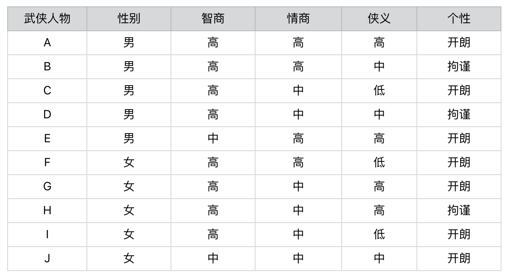
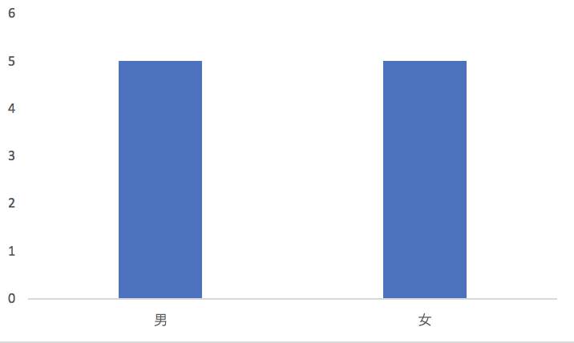
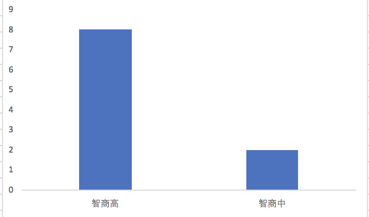
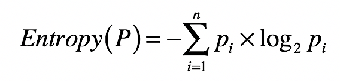
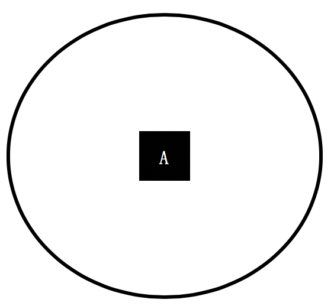
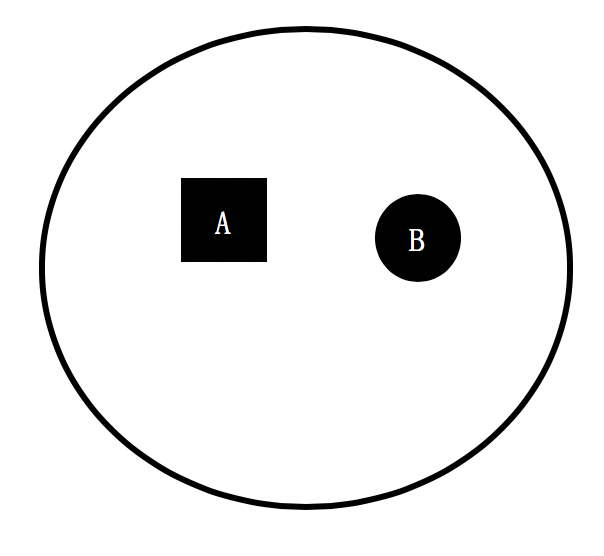
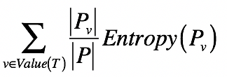
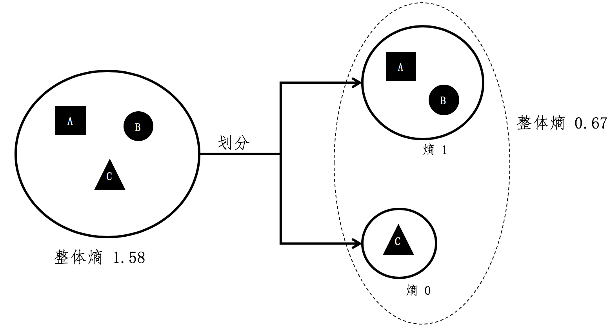
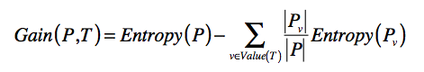

## 引子: 如何确定问题的区分能力

下面是一个问卷，第一列是答案，其余列都是问题：

如何确定这些问题的区分能力的强弱？

比如性别这个问题，可以把武侠人物分为50% - 50%：

智商这个问题，可以把武侠人物分为80% - 20%：

有没有什么科学的度量指标来衡量问题的区分能力？

## 信息熵(Entropy)

信息熵是用来刻画给定集合的**纯净度**的一个指标。比如说，一个集合里的元素全部是属于同一个分组，这个时候就表示最纯净，我们就说熵为 0；如果这个集合里的元素是来自不同的分组，那么熵是大于 0 的值。其具体的计算公式如下：

其中，<big>P</big>代表集合，<big>n</big> 表示集合中分组的数量，<big>p</big>i 表示属于第 i 个分组的元素在集合中出现的概率。

总的来说：

* 概率大，信息量小，熵小，越纯净
* 概率小，信息量大，熵大，越不纯净

下面是熵公式的来源：

熵公式描述的是某个随机变量的**信息量**之期望，信息量是信息论中的一个度量，简单来说就是，当我们观察到某个随机变量的具体值时，接收到了多少信息。而我们接收到的信息量跟发生事件的概率有关。**事情发生的概率越大，产生的信息量越小；事情发生的概率越小，产生的信息量越大。**

因此，我们想要设计一个能够描述信息量的函数，就要同时考虑到下面这三个特点：

* 信息量应该为正数；
* 一个事件的信息量和它发生的概率成反比，即 事件发生的概率越小，事件发生时的信息量则越大；
* <big>H</big>(x) 与 <big>P</big>(x) 的对数有关。<big>H</big>(x) 表示 x 的信息量，<big>P</big>(x) 表示 x 出现的概率。假设有两个不相关的事件 x 和 y，我们观察到这两个事件同时发生时获得的信息量，应该等于这两个事件各自发生时获得的信息量之和，用公式表达出来就是 <big>H</big>(x,y)=<big>H</big>(x)+<big>H</big>(y)。之前我们说过，如果 x，y 是两个不相关的事件，那么就有 <big>P</big>(x,y)=<big>P</big>(x)∗<big>P</big>(y)。

依照上述这三点，我们可以设计出信息量公式：<big>H</big>(x) <big>=</big> <big>-log</big>(<big>P</big>(x),<big>2</big>)。

这个公式可以量化随机变量某种取值时，所产生的信息量。最后，**加上计算随机变量不同可能性所产生的信息量之期望，我们就得到了熵的公式**。

以集合的例子来说明熵公式：

下面是一个集合，它只包含了来自 A 组的元素。那么集合中分组的数量 n 为 1，A 分组的元素在集合中出现的概率为 100%，所以这个集合的熵为 -100%*log(100%, 2) = 0。

另一个集合，它只包含了来自 A 组和 B 组的元素，其中 A、B 两组元素数量一样多，各占一半。那么集合中分组的数量 n 为 2，A 和 B 分组的元素在集合中出现的概率各为 50%，所以这个集合的熵为 2*(-50%*log(50%, 2)) = 1，高于刚才那个集合。

从上述两个集合的对比可以看出，一个集合中所包含的分组越多、元素在这些分组里分布得越均匀，熵值也越大。

## 若干小集合的整体信息熵

把一个大集合分割成若干小集合后，怎么计算整体熵呢？

<big>T</big> 表示一种划分，<big>P</big>v 表示划分后其中某个小集合，<big>Entropy</big>(<big>P</big>v) 表示某个小集合的熵， 而 |<big>P</big>v|/|<big>P</big>| 表示某个小集合出现的概率。公式其实就表示，**对于多个小集合而言，其整体的熵等于各个小集合之熵的加权平均**。

假设 A、B、C 三个集合是一个大的整体，我们现在将 C 组的元素和 A、B 组分开。

A 和 B 组元素所组成的小集合，它的熵是 1，形成的集合出现的概率为 2/3。而 C 组没有和其他组混合，所形成的小集合其熵为 0，形成的集合出现概率为1/3。所有整体熵 =2/3 * 1+1/3 * 0=0.67。

## 信息增益(Information Gain)

如果我们将划分前后的整体熵做个对比，你会发现划分后的整体熵要小于划分之前的整体熵。我们将划分后整体熵的下降，称为**信息增益（Information Gain）**：

<big>Entropy</big>(<big>P</big>) 表示选择特征 <big>T</big> 之前的熵，<big>Entropy</big>(<big>P</big>v) 表示特征 <big>T</big> 取值为 v 分组的熵，减号后面的部分表示选择 <big>T</big> 做决策之后，各种取值加权平均后整体的熵。

<big>Gain(P,T)</big> 表示两个熵值之差，越大表示信息增益越多，应该选择这维特征 <big>T</big>。

回到文章开头的题目，**假设被测者的概率分布和这 10 位武侠人物的先验概率分布相同**（这是一个很重要的假设，实际情况中可能并不相同），那么被测者集合的熵为 10*(-1 * 0.1 * log(0.1, 2))=3.32。

如果使用”性别“作为测试问题对人物进行划分，得到两个小集合，每个小集合包含 5 种不同的人物分组，每个小集合的熵是 (-1 * 5 * 0.2 * log(0.2, 2)) = 2.32，两个小集合的整体熵是 0.5 * 2.32 + 0.5 * 2.32 = 2.32，**信息增益是 3.32 - 2.32 = 1**。

如果使用“智商”作为测试问题对人物进行划分，得到两个小集合，一个包含了 8 种人物，另一个包含了 2 种人物。包含 8 种人物的小集合其熵是 (-1* 8 * 0.125 * log(0.125, 2)) = 3，包含 2 种人物的小集合其熵是 (-1* 2 * 0.5 * log(0.5, 2)) = 1。两个小集合的整体熵是 0.8 * 3 + 0.2 * 1 = 2.6，**信息增益是 3.32 - 2.6 = 0.72**。

**所以，“性别”比“智商”更具有区分能力。**

我们可以利用信息熵和信息增益来安排测试问题的先后顺序。
