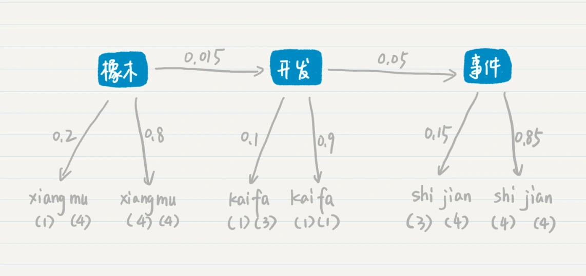

# 语音识别: 隐马尔科夫模型

## 隐马尔科夫模型

隐马尔科夫模型需要回答的最主要问题是：给定一个模型和某个特定的输出序列，如何找到最可能产生这个输出的状态序列？

语音识别，我们是无法确定马尔科夫过程中某个状态的取值的。使用概率对语音进行识别的过程，和语言模型类似，因此我们可以把每个等待识别的词对应为马尔科夫过程中的一个状态。不过，语音识别所面临的困难更大。为什么呢？你先看看下面这个句子。

```
ni(三声) zhi(一声) dao(四声) wo(三声) zai(四声) deng(三声) ni(三声) ma(一声)
```

计算机只知道某个词的发音，而不知道它具体怎么写，对于这种情况，我们就认为计算机只能观测到每个状态的部分信息，而另外一些信息被“隐藏”了起来。这个时候，我们就需要用隐马尔科夫模型来解决这种问题。

**隐马尔科夫模型有两层，一层是我们可以观测到的数据，称为“输出层”，另一层则是我们无法直接观测到的状态，称为“隐藏状态层”。**看下图：


其中，x1​，x2​，x3​ 等等属于隐藏状态层（文字），a12​ 表示了从状态 x1​ 到 x2​ 的转移概率，a23​ 表示了从状态 x2​ 到 x3​ 的转移概率。这一层和普通的马尔科夫模型是一致的，可惜在隐马尔科夫模型中我们无法通过数据直接观测到这一层。

我们所能看到的是，y1，y2，y3 等等代表的“输出层”（语音）。另外，b11 表示了从状态 x1 到 y1 的输出概率，b22 表示了从状态 x2 到 y2 的输出概率，b33 表示了从状态 x3 到 y3 的输出概率等等。

那么在这个两层模型示例中，“隐藏状态层”产生“输出层”的概率是一系列条件概率决定的：


## 语音识别举例说明

计算机接收了一堆语音：

```
xiang(四声)mu(四声) kai(一声)fa(一声) shi(四声)jian(四声)
```

假设根据我们手头上的语料数据，这个词组有多种可能，我列出两种。

### 第一种情况


注意：

* 这里是不考虑语调找到的词语。
* “项目”有3种发音，因为这是根据历史语料统计出来的，因为会根据不同地区、不同性别、不同年龄等等的人群，采集发音的样本。

那么“项目开发时间”最后生成的概率：


### 第二种情况



“橡木开发事件”这个词组最后生成的概率：


最后比较第一种和第二种情况产生的概率，分别是 P(项目)x0.0027 和 P(橡木)x0.000459。假设 P(项目) 和 P(橡木) 相等，那么“项目开发时间”这个词组的概率更高。所以“xiang（四声）mu（四声）kai（一声）fa（一声）shi（四声）jian（四声）”这组发音，计算机会识别为“项目开发时间”。

## 优化解法

上述的例子只列出了两种可能，但是，实际中可能性是非常多的，如果我们使用穷举法，那么复杂度一定很高。

可以把两层的模型看作图结构。其中，状态和输出是结点，转移和输出关系是边，相应的概率是边的权重，这个时候我们就可以对 **Dijkstra 算法**稍加修改，来找出权重乘积最大的最优路径，提升查找的效率。

我们还可以利用状态序列之间存在的先后关系，使用基于动态规划的**维特比（Viterbi）算法**来找出最优路径。

## 思考题

机器翻译会使用大量的语料，自动学习不同语言之间词和词的匹配。如果在机器翻译中使用隐马尔科夫进行建模，你认为“隐藏状态层”表示的是什么？“输出层”表示的又是什么？

假设是英文翻译成中文

隐藏状态层：中文

输出层：英文