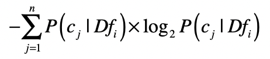
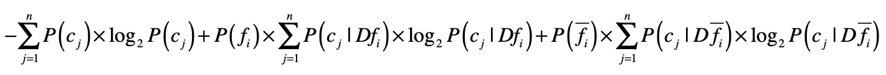
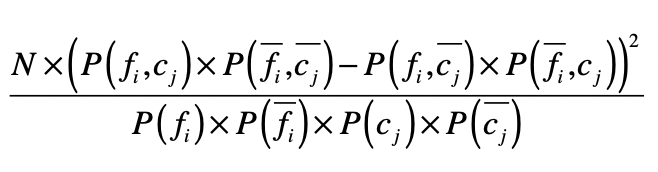

# 寻找关键特征: 信息增益, 卡方

## 特征工程

特征工程远包含：

* 原始特征到计算机数据的转化
* **特征选择（非常重要）**
* 缺失值的填补
* 异常值的去除
* 等等

## 利用信息熵

对于一篇自然语言的文章，我们主要使用词包（Bag of Words）模型和分词，把完整的文章切分成多个单词或词组，而它们就表示了文章的关键属性，也就是用于机器学习的特征。

怎么能知道哪些特征是更重要的呢？对于分类问题，我们更关心的是如何正确地把一篇文章划分到正确的分类中。这里，我就可以使用信息熵和信息增益来进行特征选择。

如果一个特征，经常只在某个或少数几个分类中出现，而很少在其他分类中出现，那么说明这个特征具有较强的区分力，它的出现很可能预示着整个数据属于某个分类的概率很高或很低。

举个例子，出现“电影”这个词的文章，经常出现在“娱乐”这个分类中，而很少出现在“军事”“政治”等其他分类中。

是否属于少数几个类这一点，可以使用信息熵来衡量。我用 <big>Df</big>i 来表示所有出现特征 <big>f</big>i 的数据集合，这个集合一共包含了 <big>n</big> 个分类 <big>C</big>，而 <big>c</big>j 表示这 <big>n</big> 个分类中的第 <big>j</big> 个。然后我们就可以根据 <big>Df</big>i 中分类 <big>C</big> 的分布，来计算熵。

**如果熵值很低，说明包含这个特征的数据只出现在少数分类中，对于分类的判断有价值**。计算出每个特征所对应的数据集之熵，我们就可以按照熵值由低到高对特征进行排序，挑选出排列靠前的特征。

## 利用信息增益

利用信息熵的做法只考虑了单个特征出现时，对应数据的分类情况，而并没有考虑整个数据集的分类情况。比如，虽然出现“电影”这个词的文章，经常出现在“娱乐”这个分类中，很少出现在其他分类中，但是可能整个样本数据中，“娱乐”这个分类本来就已经占绝大多数，所以“电影”可能并非一个很有信息含量的特征。

为了改进这一点，我们可以借用决策树中信息增益的概念。我们把单个特征 f 是不是出现作为一个决策条件，将数据集分为 <big>Df</big>i 和 <big>Df</big>i<big>ˉ</big> ，<big>Df</big>i 表示出现了这个特征的数据，而 <big>Df</big>i<big>ˉ</big> 表示没有出现这个特征的数据。那么使用特征 <big>f</big>i 进行数据划分之后，我们就能得到基于两个新数据集的熵，然后和没有划分之前的熵进行比较，得出信息增益。

## 利用卡方检验进行特征选择

在统计学中，我们使用卡方检验来检验两个变量是否相互独立，如果两者独立，证明特征和分类没有明显的相关性，特征对于分类来说没有提供足够的信息量。反之，如果两者有较强的相关性，那么特征对于分类来说就是有信息量的，是个好的特征。

为了检验独立性，卡方检验考虑了四种情况的概率：<big>P</big>(<big>f</big>i,<big>c</big>j)  、<big>P</big>(<big>f</big>i<big>ˉ</big>,<big>c</big>j<big>ˉ</big>)、<big>P</big>(<big>f</big>i,<big>c</big>j<big>ˉ</big>) 和 <big>P</big>(<big>f</big>i<big>ˉ</big>,<big>c</big>j)。

<big>P</big>(<big>f</big>i,<big>c</big>j)  和<big>P</big>(<big>f</big>i<big>ˉ</big>,<big>c</big>j<big>ˉ</big>)表示特征 <big>f</big>i 和分类 <big>c</big>j 是**正相关**的，如果 <big>P</big>(<big>f</big>i,<big>c</big>j)   很高，表示特征 <big>f</big>i 的出现意味着属于分类 <big>c</big>j 的概率更高；如果 <big>P</big>(<big>f</big>i<big>ˉ</big>,<big>c</big>j<big>ˉ</big>) 很高，表示特征 <big>f</big>i 不出现意味着不属于分类 <big>c</big>j 的概率更高。

<big>P</big>(<big>f</big>i,<big>c</big>j<big>ˉ</big>) 和 <big>P</big>(<big>f</big>i<big>ˉ</big>,<big>c</big>j) 表示特征 <big>f</big>i 和分类 <big>c</big>j 是**负相关**的。如果 <big>P</big>(<big>f</big>i,<big>c</big>j<big>ˉ</big>) 很高，表示特征 <big>f</big>i 的出现意味着不属于分类 <big>c</big>j 的概率更高；如果 <big>P</big>(<big>f</big>i<big>ˉ</big>,<big>c</big>j) 很高，表示特征 <big>f</big>i 不出现意味着属于分类 <big>c</big>j 的概率更高。

如果特征和分类的相关性很高，要么是正向相关值远远大于负向相关值，要么是负向相关值远远大于正向相关值。如果特征和分类相关性很低，那么正向相关值和负向相关的值就会很接近。卡方检验就是利用了正向相关和负向相关的特性。

其中，<big>N</big> 表示数据的总个数。通过这个公式，你可以看到，**如果一个特征和分类的相关性很高，无论是正向相关还是负向相关，那么正向相关和负向相关的差值就很大，最终计算的值就很高**。最后，我们就可以按照卡方检验的值由高到低对特征进行排序，挑选出排列靠前的特征。

## 疑问

* 本文是否只适用于基于词包模型的分类？不是，只要是标签分类的都可以。
* 卡方公式中，<big>c</big>j有很多个怎么计算？按照例子，只检查了【特征：电影】和【分类：娱乐】的关系，没有检查和【其他分类】的关系。应该是一个一个算吧。不过实践中可以针对性的对某个【分类】挑出相关性高的特征。

