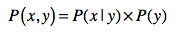

# 语言模型: 链式法则、马尔科夫假设

语言模型在不同的领域、不同的学派都有不同的定义和实现，这里只讲基于概率和统计的语言模型。

## 链式法则

链式法则使用一系列条件概念率和边缘概率，来推导联合概率：


怎么得来的？先回顾贝叶斯定理：



于是就能够推导出来了：


## 马尔科夫假设及多元文法模型

马尔科夫假设：任何一个词 wi​ 出现的概率只和它前面的 1 个或若干个词有关。

基于这个假设，我们可以提出**多元文法（Ngram）模型**，N表示任何一个词出现的概率，只和它前面的 N-1 个词有关。

一元文法模型：

每个单词的出现和其他任何单词无关。


二元文法模型：

某个单词出现的概率只和它前面的1个单词有关。


三元文法模型：

某个单词出现的概率只和它前面的2个单词有关。


## 举例说明语言模型

假设我们有一个统计样本文本 d，s 表示某个有意义的句子，由一连串按照特定顺序排列的词 w1​，w2​,…,wn​ 组成，这里 n 是句子里单词的数量。

求 s 在 d 中出现的概率，即 P(s∣d)，那么我们可以把它表示为 P(s∣d)=P(w1​,w2​,…,wn​∣d)。

假设我们这里考虑的都是在集合 d 的情况下发生的概率，所以可以忽略 d，写为 P(s)=P(w1​,w2​,…,wn​)。利用链式法则可以用下面公式计算：


但是有两个问题：

* 结果会越乘越小，比如 P(wn​∣w1​,w2​,…,wn−1​) 会是一个极小值。用平滑也不好，用太多平滑技巧会导致模型和真实的数据分布之间的差距加大，预测效果也不好。
* 导致模型存储空间急剧增大。为了计算P(s)，那么我们需要先计算文档d的先验证概率，对于P(wn​∣w1​,w2​,…,wn−1​)这种的计算就是在m个单词中抽取n个单词做可排列，就m^n级别的可能性。

用马尔可夫假设和多元文法模型简化公式，下面是三元文法模型：


## 语言模型的应用

### 信息检索


q 表示一个查询，d 表示**一篇**文档，P(d∣q) 表示用户输入查询 q 的情况下，文档 d 出现的概率是多少。根据贝叶斯定理改写：


因为对于同一个查询，其出现概率 P(q) 都是相同的，同一个文档 d 的出现概率 P(d) 也是固定的，所以忽略，也就是说计算 P(q∣d) 。让 k1​,k2​,…,kn​ 表示查询 q 里包含的 n 个关键词，根据链式法则公式改成：


再使用马尔科夫假设和多元文法（比如三元文法），进一步改写：


最终：

* 当用户输入一个查询 q 之后，对于每一篇文档 d，我们都能获得 P(d∣q) 的值。
* 根据每篇文档所获得的 P(d∣q) 这个值，由高到低对所有的文档进行排序。

公式中的P(k1|d), P(k2|k1,d), P(k3|k1,k2,d)都是事先统计好的，比如 P(k2|k1,d)可以通过计算  k2在k1之后的频次/k1出现的频次  近似求得。

### 中文分词

先通过词典对一句话做分词，可能会得到多种分词结果，比如“兵乓球拍卖完了”可以分成：

```
第一种，兵乓|球|拍卖|完了
第二种，兵乓球|拍卖|完了
第三种，兵乓|球拍|卖完|了
第四种，兵乓|球拍|卖|完了
```

然后通过语言模型来找出哪一种结果是最合理的。

假设整个文档集合是 D，要分词的句子是 s，分词结果为 w1​, … wn​，那么我们可以求 P(s) 的概率为：


根据链式法则和三元文法模型，那么上面的式子可以重写为：


然后对每个P(s)求概率，取可能性最大的那个：


其中，Wi​ 表示第 i 种分词方法。

**注意：**

* 信息检索相反，信息检索P(d|q)简化后是P(q|d)，求的是每篇文章d产生句子q的概率。
* 分词则是整个文档集合D产生某个句子s的概率。
* 文档集合D是语料，是已经分好词的。


## 一个问题

我们需要利用一个分词模型（语言模型）对文档进行分词。

也需要用 已经分好词的语料训练分词模型。

这里面存在一种循环？

## 思考题

在中文分词的时候，我们也可以考虑文章的分类。比如，这样一句话“使用纯净水源浇灌的大米”，正确的切分应该是：

```
使用|纯净|水源|浇灌|的|大米
```

如果我们知道这句描述来自于“大米”类商品，而不是“纯净水”类商品，那么就不会错误地切分为：

```
使用|纯净水|源|浇灌|的|大米
```

想想看，如何对我介绍的语言模型加以改进，把分类信息也包含进去？

### 方法一

事前准备：

1. 文档集合D中所有的文档都已经做好了分类标记。且做好了分词。
1. 文档集合D根据马尔可夫假设和Ngram模型计算好了先验概率。

步骤：

1. 从文档集合D中，提取分类为“大米”的文档集合T，这些都是已经分好词的。
1. 先根据词典分词，得到n种分词结果Wn。
1. 利用Ngram模型，和文档集合T，对每个分词结果Wi，做一个概率评估。
1. 选取概率最高的那个Wi。

### 方法二

事前准备：

1. 文档集合D中所有的文档都已经做好了分类标记。且做好了分词。
1. 文档集合D根据[朴素贝叶斯文本分类](statistics/text-classification)计算好了先验概率。

步骤：

1. 先根据词典分词，得到n种分词结果Wn。
1. 利用[朴素贝叶斯文本分类](statistics/text-classification)，计算每个分词结果Wi的分类为“大米”的概率。
1. 选取分类为“大米”概率最高的那个Wi。
