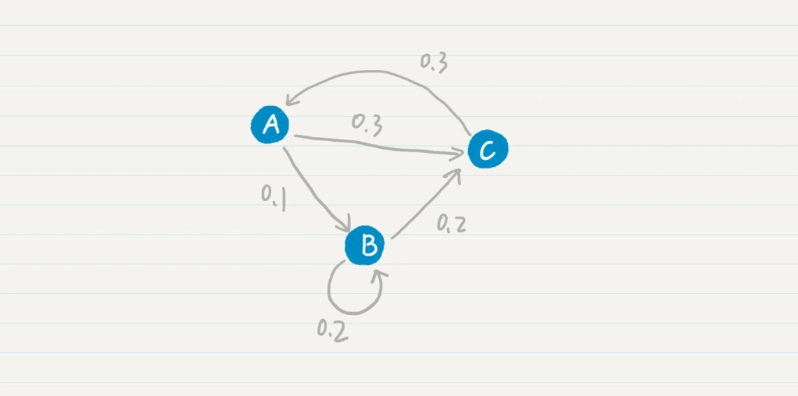
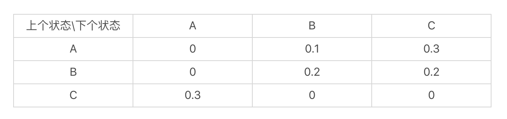
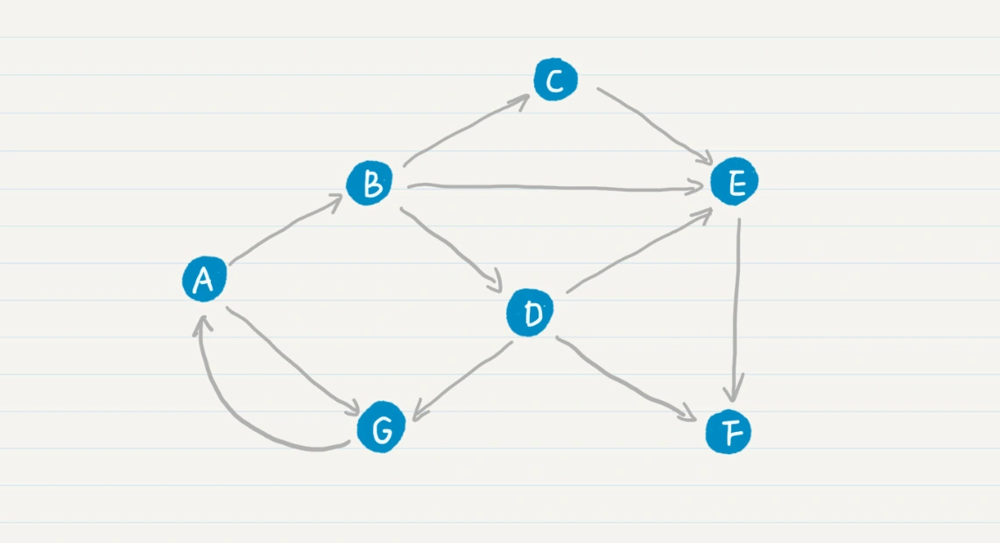
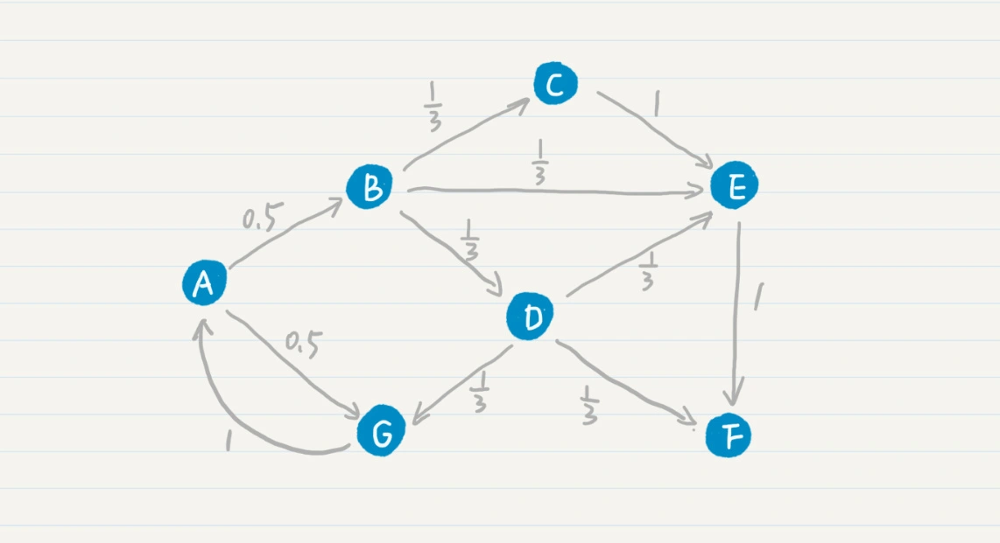
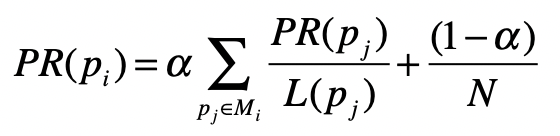

# PageRank: 马尔科夫模型

## 马尔科夫模型

回顾马尔科夫假设:

> 任何一个词 wi 出现的概率只和它前面的 1 个或若干个词有关。

我们换个角度思考就是，每个词按照一定的概率转移到下一个词。

如果把词抽象为一个状态，那么我们就可以认为，状态到状态之间是有关联的。前一个状态有一定的概率可以转移到下一个状态。如果多个状态之间的随机转移满足马尔科夫假设，那么这类随机过程就是一个马尔科夫随机过程。而刻画这类随机过程的统计模型，就是**马尔科夫模型（Markov Model）**。

对于二元文法来说，某个词出现的概率只和前一个词有关，对应的，在马尔科夫模型中，如果一个状态出现的概率只和前一个状态有关，那么我们称它为**一阶马尔科夫模型**或者**马尔科夫链**。对应于三元、四元甚至更多元的文法，我们也有二阶、三阶等马尔科夫模型。

**马尔科夫模型 - 马尔科夫链**示意图：

状态转移表来表示这张图：

## PageRank

PageRank 链接分析算法，它的核心思想就是基于马尔科夫链。

这个算法假设了一个“随机冲浪者”模型，冲浪者从某张网页出发，根据 Web 图中的链接关系随机访问。在每个步骤中，冲浪者都会从当前网页的链出网页中随机选取一张作为下一步访问的目标。在整个 Web 图中，绝大部分网页节点都会有链入和链出。那么冲浪者就可以永不停歇地冲浪，持续在图中走下去。

在随机访问的过程中，越是被频繁访问的链接，越是重要。可以看出，每个节点的 PageRank 值取决于 Web 图的链接结构。假如一个页面节点有很多的链入链接，或者是链入的网页有较高的被访问率，那么它也将会有更高的被访问概率。

我先给你看一张 Web 的拓扑图：

其中 A、B、C 等结点分别代表了页面，而结点之间的有向边代表了页面之间的超链接。

在最基本的 PageRank 算法中，我们可以假设每张网页的出度是 n，那么从这张网页转移到任何下一张相连网页的概率都是 1/n，因此这个转移的概率只和当前页面有关，满足一阶马尔科夫模型的假设

**PageRank 在标准的马尔科夫链上，引入了随机的跳转操作**，也就是假设冲浪者不按照 Web 图的拓扑结构走下去，只是随机挑选了一张网页进行跳转。这样的处理是类比人们打开一张新网页的行为，也是符合实际情况的，避免了信息孤岛的形成。最终，根据马尔科夫链的状态转移和随机跳转，可以得到如下的 PageRank 公式。

其中，<big>p</big>i 表示第 i 张网页，<big>M</big>i 是 <big>p</big>i 的入链接集合，<big>p</big>j 是 <big>M</big>i 集合中的第 j 张网页。<big>PR</big>(pj) 表示网页 <big>p</big>j 的 PageRank 得分，<big>L</big>(pj) 表示网页 <big>p</big>j 的出链接数量，1/<big>L</big>(pj) 就表示从网页 <big>p</big>j 跳转到 <big>p</big>i 的概率。<big>α</big> 是用户不进行随机跳转的概率，<big>N</big> 表示所有网页的数量。
