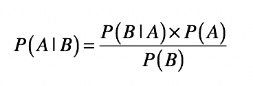
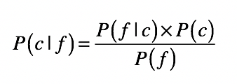
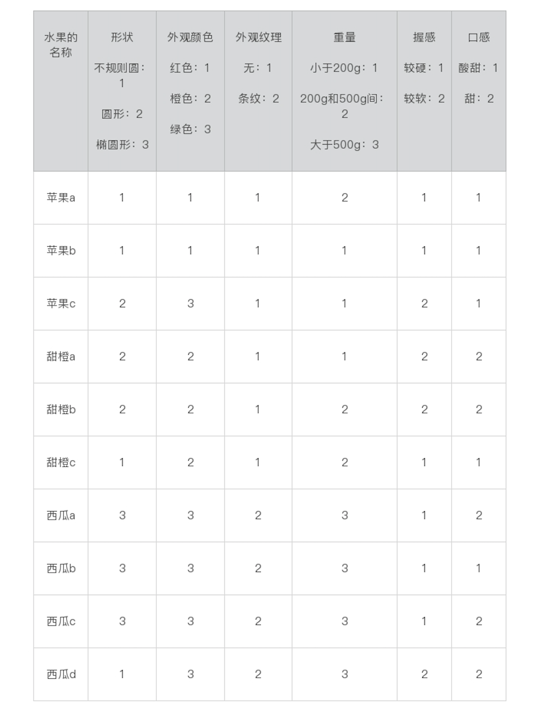
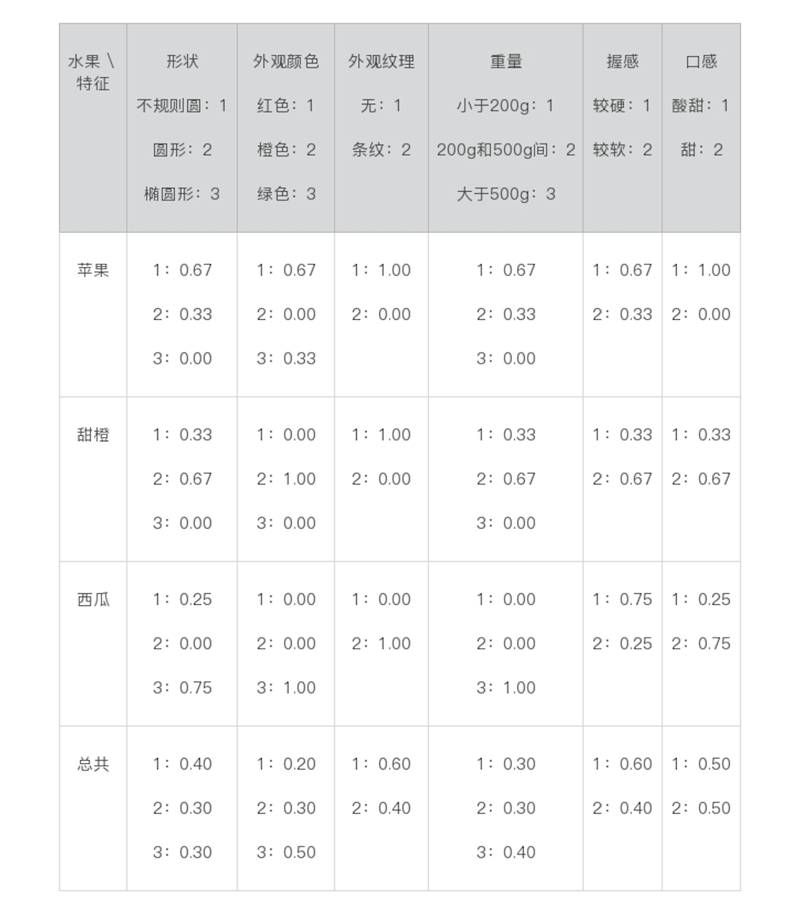

贝叶斯分类具有以下特点：

* 需要更多的时间进行模型的训练
* 支持模糊概率
* 结果不易于人类理解
* 不支持连续值，只支持离散值

## 核心思想

核心思想就是，用先验概率和条件概率估计后验概率。

## 贝叶斯分类

把分类问题的公式改写成这样：

* c 表示一个分类（class），f 表示属性对应的数据字段（field）。
* 后验概率 等号左边的 P(c|f) 就是待分类样本中，出现属性值 f 时，样本属于类别 c 的概率。
* 条件概率 P(f|c) 是根据训练数据统计，，得到分类 c 中出现属性 f 的概率。
* 先验概率 P(c) 是分类 c 在训练数据中出现的概率。
* 先验概率 P(f) 是属性 f 在训练样本中出现的概率。

也可以写成，有数据对象o，o上同时有fi、fj的属性，对象o属于类别c的概率：

上面的公式里可以看到，假设属性随机变量相互独立。

以一个水果分类的例子来说，下面是训练数据：

我们要给定各种属性，然后让计算机自动把水果分到某一类上。

于是我们通过数据预处理，计算公式中需要的条件概率：

### 平滑（Smoothing）处理

上面的条件概率有的值是0，为了避免在贝叶斯公式中的乘积结果为0，在这里需要做平滑处理，

通常取一个**比这个数据集里最小统计概率还要小的极小值**，比如0.01。

### 处理极小数

有时候最终计算结果是一个很小的数字，通过 log 将小数转换为绝对值大于 1 的负数。

## 其他分类算法

* 和 **KNN 最近邻**相比，朴素贝叶斯需要更多的时间进行模型的训练，但是它在对新的数据进行分类预测的时候，通常效果更好、用时更短。
* 和**决策树**相比，朴素贝叶斯并不能提供一套易于人类理解的规则，但是它可以提供决策树通常无法支持的模糊分类（一个对象可以属于多个分类）。
* 和 **SVM 支持向量机**相比，朴素贝叶斯无法直接支持连续值的输入。所以，在前面的案例中，我将连续值转化成了离散值，便于朴素贝叶斯进行处理。