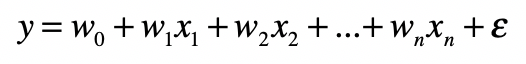

我们可以使用统计中的数据分布，对连续型的数值特征进行转换，让多个特征的结合更有效。

## 为什么要特征变换？

以**多元线性回归模型**为例，基本形式是这样的：



其中，x1，x2，…，xn 是自变量，y 是因变量，ε 是随机误差，通常假定随机误差的均值为 0。 w0 是截距，w1，w2，…，wn 是每个自变量的系数。如果某个系数大于 0，表示对应的自变量对结果是正面影响，这个自变量越大，结果就越大。否则就是负面影响，这个自变量越大，结果就越小。而系数的绝对值表示了影响程度的大小，如果绝对值趋于 0，表示基本没有影响。

但是，在正式开始线性回归分析之前，还有一个问题，那就是不同字段的数据没有可比性。

比如，房屋的面积和建造的年份，它们分别代表了不同的含义，也有不一样的取值范围。在线性回归中，如果直接将没有可比性的数字型特征线性加和，那么模型最终的解释肯定会受影响。

以Boston Housing为例（https://www.kaggle.com/c/boston-housing）说明一下：

```python
import pandas as pd
from sklearn.linear_model import LinearRegression


df = pd.read_csv("/Users/shenhuang/Data/boston-housing/train.csv")       #读取Boston Housing中的train.csv
df_features = df.drop(['medv'], axis=1)     #Dataframe中除了最后一列，其余列都是特征，或者说自变量
df_targets = df['medv']         #Dataframe最后一列是目标变量，或者说因变量


regression = LinearRegression().fit(df_features, df_targets)        #使用特征和目标数据，拟合线性回归模型
print(regression.score(df_features, df_targets))    #拟合程度的好坏
print(regression.coef_)            #各个特征所对应的系
```

得到结果：

```python
0.735578647853312
[-4.54789253e-03 -5.17062363e-02  4.93344687e-02  5.34084254e-02
  3.78011391e+00 -1.54106687e+01  3.87910457e+00 -9.51042267e-03
 -1.60411361e+00  3.61780090e-01 -1.14966409e-02 -8.48538613e-01
  1.18853164e-02 -6.01842329e-01]
```

## 归一化

归一化（Normalization）。它其实就是获取原始数据的最大值和最小值，然后把原始值线性变换到[0,1]之间，具体的变换函数为：


其中 x 是原始值，max 为样本数据的最大值，min 为样本数据的最小值，x’ 是变换后的值。

**这种方法有个不足最大值与最小值非常容易受噪音数据的影响。**

```python
from sklearn.preprocessing import MinMaxScaler

minMaxScaler = MinMaxScaler()       #基于min和max值的归一化

df_normalized = minMaxScaler.fit_transform(df)  #对原始数据进行归一化，包括特征值和目标变量
df_features_normalized = df_normalized[:, 0:-1] #获取归一化之后的特征值
df_targets_normalized = df_normalized[:, -1]    #获取归一化之后的目标值

#再次进行线性回归
regression_normalized = LinearRegression().fit(df_features_normalized, df_targets_normalized)
print(regression_normalized.score(df_features_normalized, df_targets_normalized))
print(regression_normalized.coef
```

得到结果：

```python
0.7355786478533118
[-0.05103746 -0.08448544  0.10963215  0.03204506  0.08400253 -0.16643522
  0.4451488  -0.01986622 -0.34152292  0.18490982 -0.13361651 -0.16216516
  0.10390408 -0.48468369]
```

观察结果：

* 最主要的正相关特征是 age（0.4451488）和 tax（0.18490982），也就是老房子占比和房产税的税率，其中至少房产税的税率是比较合理的，因为高房价的地区普遍税率也比较高。
* 最主要的负相关特征是 rad（-0.34152292）和 lstat（-0.48468369），rad 表示高速交通的便利程度，它的值越大表示离高速越远，房价中位数越低。而 lstat 表示低收入人群的占比，这个值越大房价中位数越低，这两点都是合理的。

## z-score标准化

基于正态分布的 z 分数（z-score）标准化（Standardization）。**该方法假设数据呈现标准正态分布**。回顾[一文搞懂“正态分布”所有需要的知识点](https://zhuanlan.zhihu.com/p/128809461)。

**正态分布**以经过平均数的垂线为轴，左右对称展开，中间点最高，然后逐渐向两侧下降，分布曲线和 x 轴组成的面积为 1，表示不同事件出现的概率和为 1。平均数和标准差是正态分布的关键参数，它们会决定分布的具体形态。**标准正态分布是正态分布的一种，平均数为 0，标准差为 1**。

z 分数标准化是利用标准正态分布的特点，计算一个给定分数距离平均数有多少个标准差。它的具体转换公式如下：


其中 x 为原始值，u 为均值，σ 为标准差，x’ 是变换后的值。

```python
from sklearn.preprocessing import StandardScaler

standardScaler = StandardScaler()    #基于Z分数的标准化

standardScaler.fit(df)
df_standardized = standardScaler.transform(df)  #对原始数据进行标准化，包括特征值和目标变量

df_features_standardized = df_standardized[:, 0:-1] #获取标准化之后的特征值
df_targets_standardized = df_standardized[:, -1]    #获取标准化之后的目标值

#再次进行线性回归
regression_standardized = LinearRegression().fit(df_features_standardized, df_targets_standardized)
print(regression_standardized.score(df_features_standardized, df_targets_standardized))
print(regression_standardized.coef
```

得到结果：

```python
0.7355786478533118
[-0.07330367 -0.04144107  0.12194378  0.04074345  0.09805446 -0.19311408
  0.29767387 -0.02916672 -0.34642803  0.34477088 -0.21410757 -0.19904179
  0.11218058 -0.46369483]
```

观察结果：

* 最主要的正相关特征还是 age（0.29767387）和 tax（0.34477088），但是相比之前，明显房产税的税率占了更高的权重，更加合理。
* 最主要的负相关特征还是 rad（-0.34152292）和 lstat（-0.48468369），这两点都是合理的。

