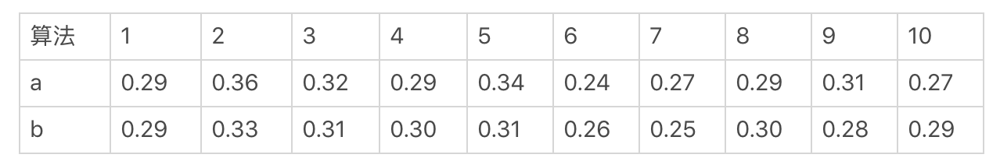
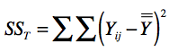
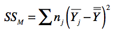
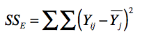
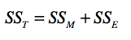
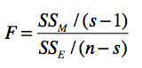
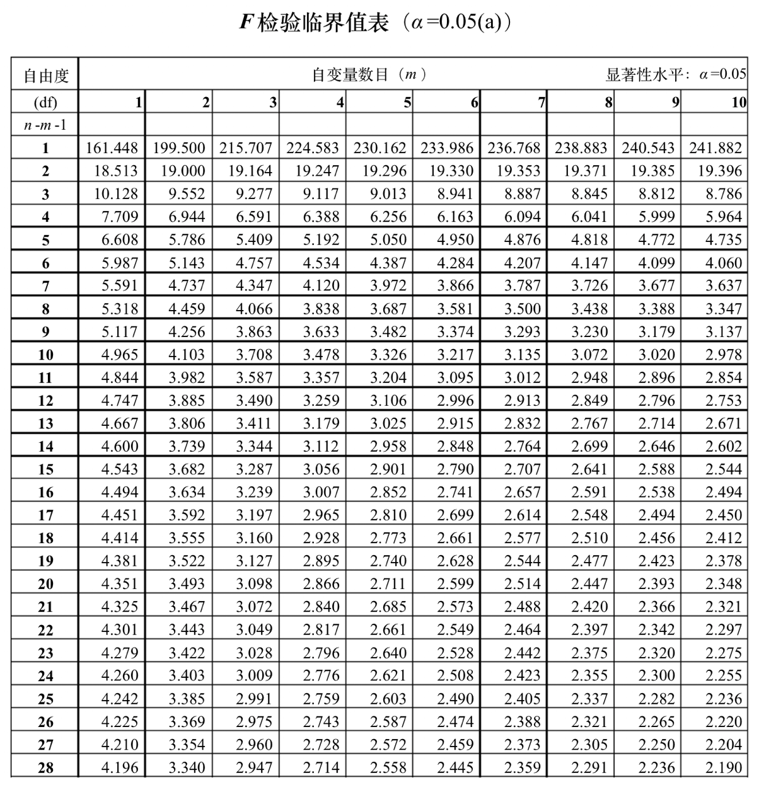

# 显著性检验 - 方差分析（F检验）

方差分析（Analysis of Variance, ANOVA），也叫 F 检验。这种方法可以**检验两组或者多组样本的均值是否具备显著性差异**。它有四个前提假设，分别是：

* 随机性：样本是随机采样的；
* 独立性：来自不同组的样本是相互独立的；
* 正态分布性：组内样本都来自一个正态分布；
* 方差齐性：不同组的方差相等或相近。

在 A/B 测试案例，通过方差分析来检验**多种算法**所产生的用户转化率有没有显著性差异。我们把“转化率”称为“因变量”，把“算法”称为“因素”。这里我们只有算法一个因素，所以所进行的方差分析是单因素方差分析。在方差分析中，因素的取值是离散型的，我们**称不同的算法取值为“水平”**。如果我们比较算法 a 和 b，那么 a 和 b 就是算法这个因素的两个水平。

我们假设只有两种算法 a 和 b 参与了 A/B 测试。为了检验这些算法导致的转化率，是不是存在显著的差异，我们进行一个为期 10 天的测试，每天都为每种算法获取一个转化率。具体的数据我列在下面这张表格中。

我使用 <big>Y</big>ij 来表示这种表格中的数据，i 表示第 i 次采样（或第 i 天），j 表示第 j 种水平（或第 j 种算法）。以上面这张表格为例，<big>Y</big>51=0.34。

如果我们把每种算法导致的转化率看作一个数据分布，那么方差分析要解决的问题就是：这两个转化率分布的均值，是不是相等。如果我把两种数据分布的均值记做μ1 和μ2，那么原假设 H0 就是μ1=μ2。而对立假设 H1 就是μ1 <> μ2。

差异是不是显著性，关键要看这个差异是采样的偶然性引起的，还是分布本身引起的，方差分析的核心思想也是围绕这个展开的，因此它计算了三个数值：

**因变量方差SST（Total Sum of Squares）**，表示所有采样数据的因变量方差：

<big>Y</big>ij 如前所说，表示了第 i 天第 j 种算法所导致的转化率，<big>Y</big>(=)代表2 种算法全部 20 个数据的平均值。

**模型平方和SSM（Sum Of Squares for Model），表示数据分布所引起的方差**：

<big>n</big>j 为水平 j 下的观测数量，<big>Y</big>j(-) 为第 j 个水平的平均值，<big>Y</big>j(-)−<big>Y</big>(=) 表示的是某个算法的采样均值和所有采样均值之间的差异，<big>n</big>j 是相应的权重

**误差平方和SSE（Sum of Squaress for Error），表示采样引起的方差**：

SST、SSM和SSE的关系是这样的：

* 如果SSM（数据分布所引起的方差）占比更大，那么说明因素对因变量的差异具有显著的影响；
* 如果SSE（采样引起的方差）占比更大，那么说明采样误差对因变量的差异具有更显著的影响。

我们使用这两部分的比例来衡量显著性：

s 是水平的个数，n 为所有样本的总数量，s-1=2-1=1 为分布的**自由度**，n-s=20-2=18 为误差的**自由度**（见下文说明）。

在我们的案例中，F=(0.00018/(2-1))/(0.01652/(20-2))=0.196125908。

然后根据 **F 检验值的临界表**（可以搜索[F 检验值的临界表](https://www.google.com/search?q=F+%E6%A3%80%E9%AA%8C%E5%80%BC%E7%9A%84%E4%B8%B4%E7%95%8C%E8%A1%A8)找到更多表格）来显著性水平α为 0.05 的时候，F 值的临界值，**如果F值大于临界值，那么P 值就会小于显著性水平α，证明差异具有显著性**：

在我们的案例中，n=20，m=s-1=1，对应的F 临界值为 4.414，实际 F 值为 0.196远远小于临界值，所以 P 值大于显著性水平α，证明差异不具有显著性。虽然算法 a 所导致的平均转化率要比算法 b 的相对高出约 2%，但是由于差异没有显著性，所以这个提升的偶然性很大，并不意味着算法 a 比算法 b 更好。

## 自由度（degree of freedom）

英文缩写是 df，它是指采样中能够自由变化的数据个数。对于一组包含 n 个数据的采样来说，如果方差是一个固定值，那么只有 n-1 个数据可以自由变化，最后一个数的取值是给定的方差和其他 n-1 个数据决定的，而不由它自己随意变化，所以自由度就是 n-1。

在方差分析中，对于 SSM 来说，如果 SSM 是固定的，那么对于 s 个水平来说，只能有 s-1 个组数据自由变化，而最后一组数据必须固定，所以对应于 SSM 的自由度为 s-1。

对于 SSE 来说，如果 SSE 是固定的，那么对于 n 个采样、s 个水平数据来说，只有 n-s 个数据是可以自由变化的。因为每个水平中，都要有一个数据需要保证该组的平均值 <big>Y</big>j 而无法自由变化。

## Python代码

见仓库 notebooks/anova-f.ipynb