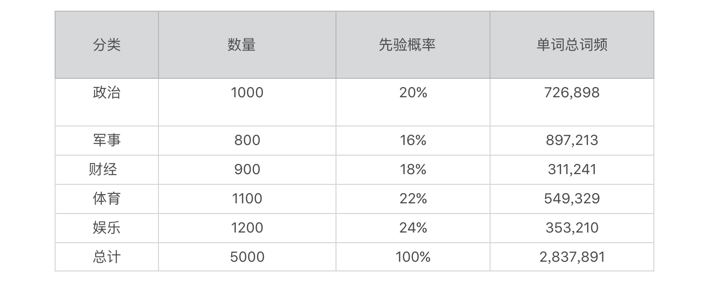
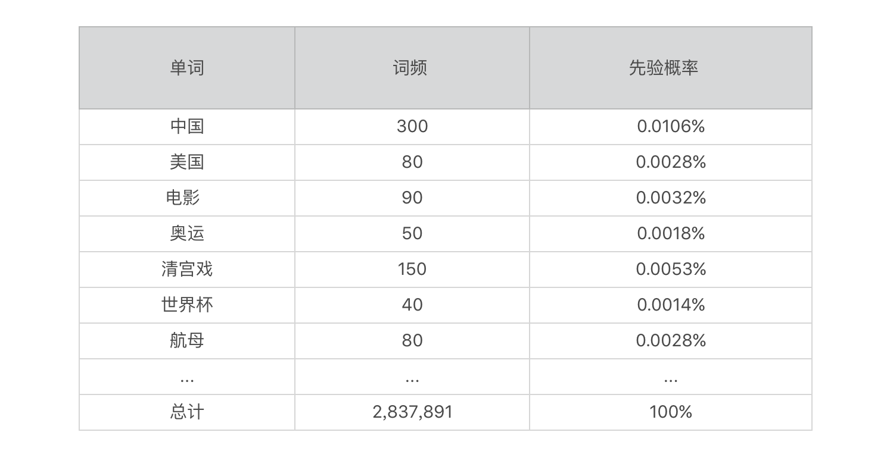
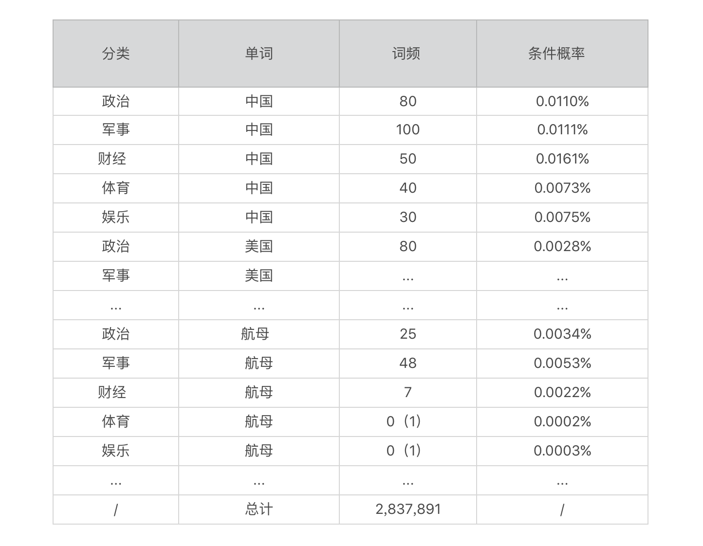
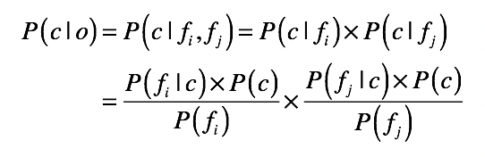
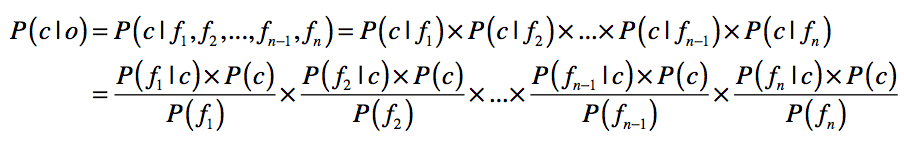

# 基于朴素贝叶斯的文本分类

## 文本分类系统的基本框架

1. 采集训练样本，对每篇文章标注好分类，这个是标准答案
2. [预处理自然语言](statistics/nlp-preprocessing)。
3. 训练模型。训练模型就是算法通过训练数据进行模型拟合的过程。对于[朴素贝叶斯](statistics/naive-bayes)方法而言，训练的过程就是要获取每个分类的先验概率、每个属性的先验概率以及给定某个分类时，出现某个属性的条件概率。
4. 实时分类预测。算法模型在训练完毕后，根据新数据的属性来预测它属于哪个分类的过程。对于朴素贝叶斯方法而言，分类预测的过程就是根据训练阶段所获得的先验概率和条件概率，来预估给定一系列属性的情况下属于某个分类的后验概率。

## 预处理

通过词包模型的假设，以及上述这些自然语言处理的方法，我们可以将整篇的文字，切分为一个个的单词，这些是表示文章的关键属性。

下面我对分类的先验概率、单词的先验概率、某个分类下某个单词的条件概率分别给出了示例。

## 运用朴素贝叶斯

* o 表示一篇文章
* c 表示新闻的种类（包括政治、军事、财经等等）
* f 就是我们从文档集而建立的各种单词

现在给定一篇文章，推算其分类。通过朴素贝叶斯公式，计算这篇文章属于不同种类的概率。

实际情况中，因为文章的单词特别多，因此会形成下面的情况，导致最后的乘积趋近于0：

可以取 log，将小数转换为绝对值大于 1 的负数，乘积结果的绝对值越大则代表概率越低。