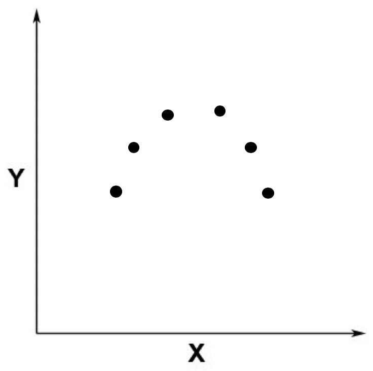
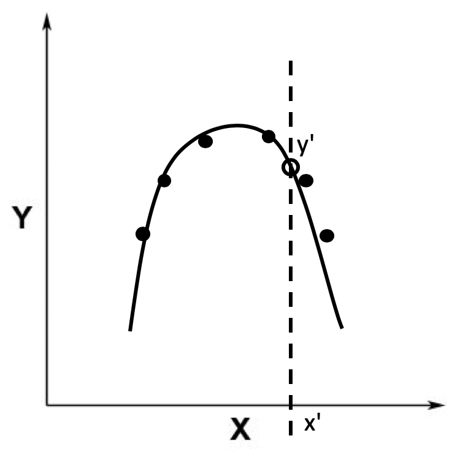
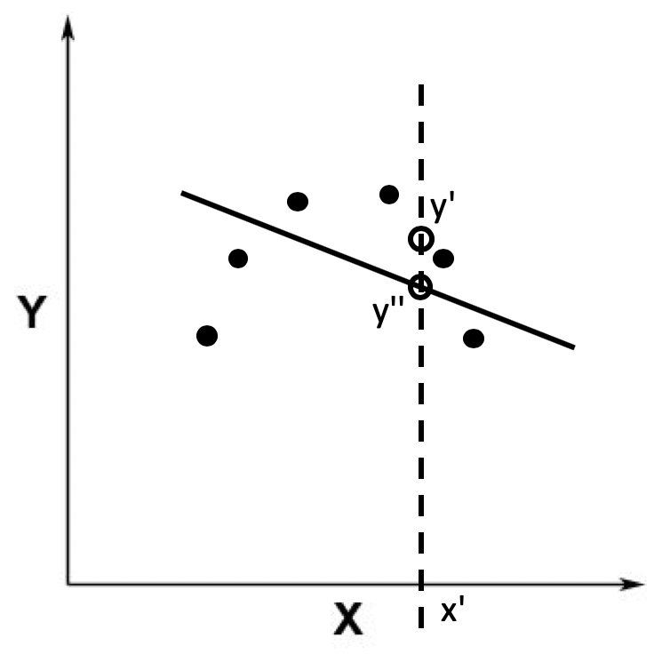
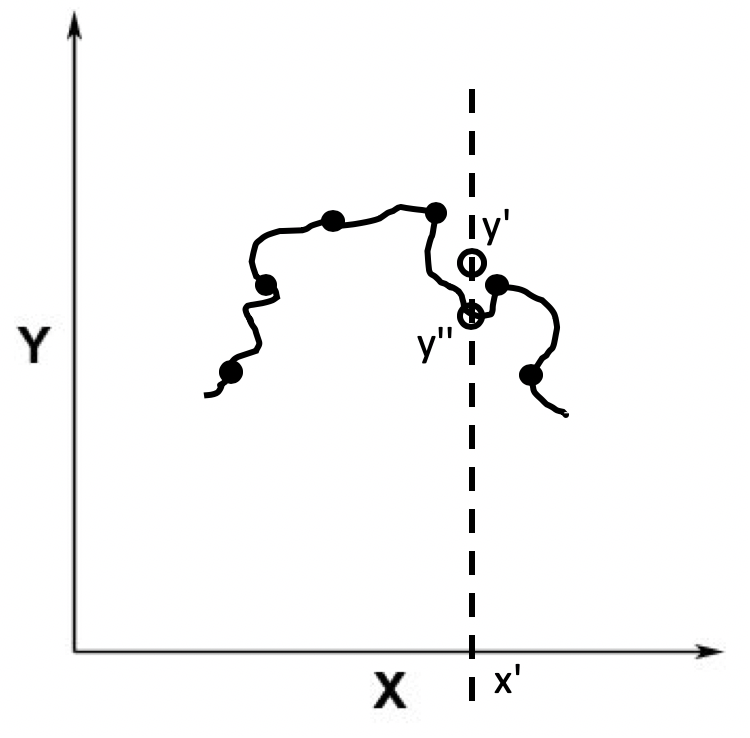
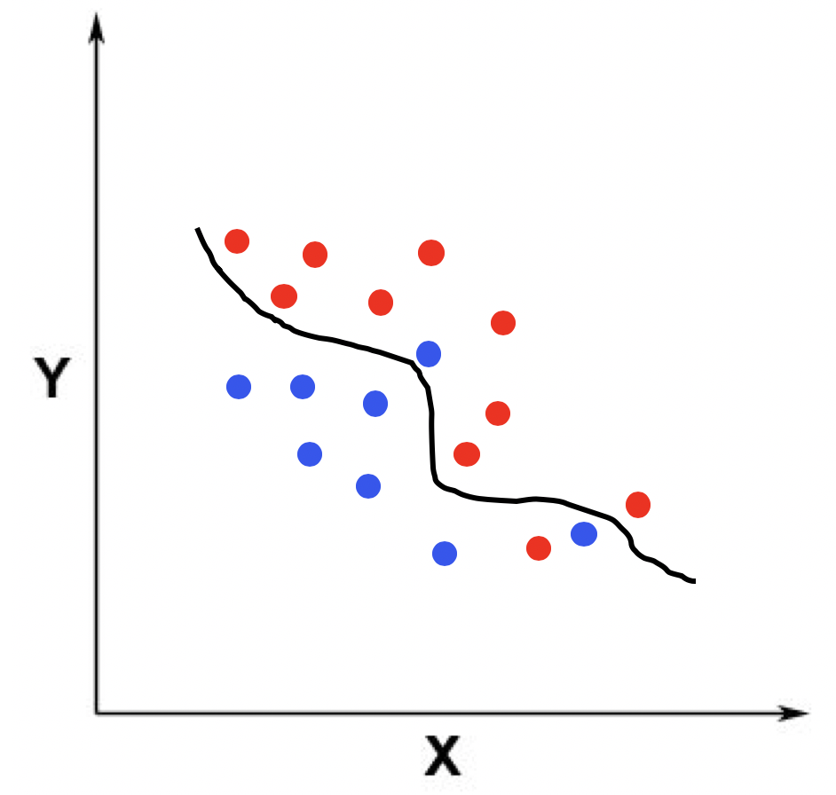
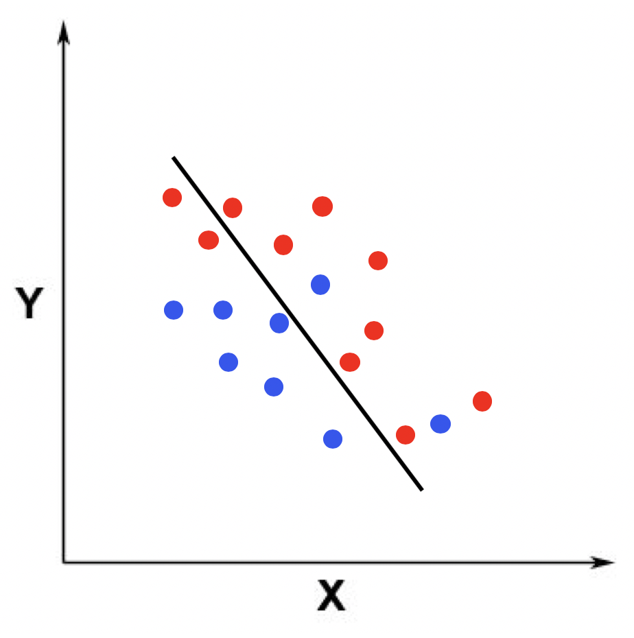
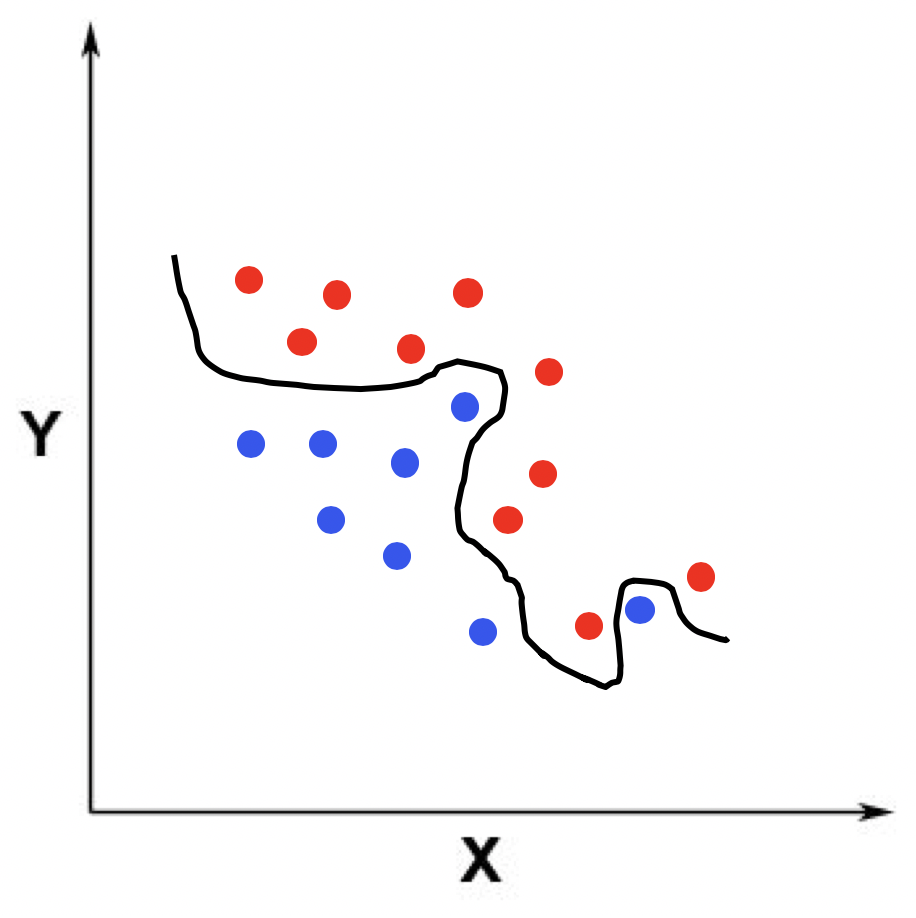
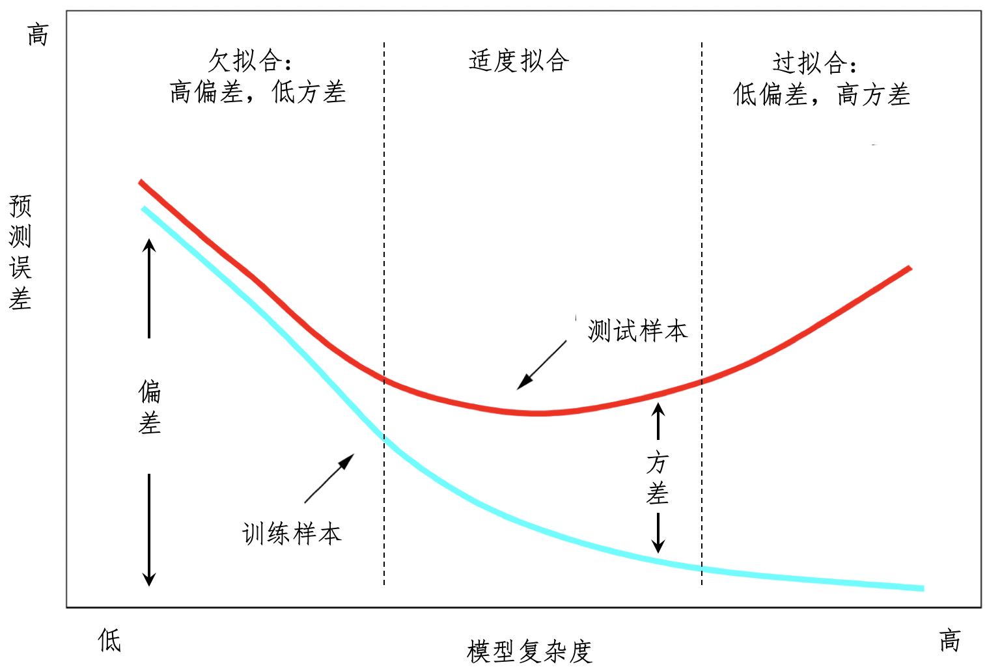

# 为何会有欠拟合和过拟合？

每种学习模型都有自己的假设和参数：

朴素贝叶斯：

* 假设：贝叶斯定理和变量之间的独立性
* 参数：各种先验概率和条件概率

决策树：

* 假设：假设是集合的纯净程度或者混乱程度
* 参数：各个树结点以及结点上的决策条件

拟合模型其实就是指通过模型的假设和训练样本，推导出具体参数的过程，然后就能对新数据做出预测。

## 适度拟合

假设我们的数据点分布在一个二维空间，其中黑色的点表示训练数据所对应的点，x 轴表示唯一的自变量，y 轴表示因变量：

根据这些训练数据，拟合回归模型之后，所得到的模型结果是一条黑色的曲线。有了这条曲线，我们就能根据测试数据的 x 轴取值（如图中的 x’）来获取 y 轴的取值（如图中的 y’），这种情况就是适度拟合（right fitting）:

## 欠拟合

有的时候拟合得到的模型**过于简单**，和训练样本之间的误差非常大，这种情况就是**欠拟合**（Under Fitting），这种**拟合模型和训练样本之间的差异**，我们就称为**偏差**（Bias）：

## 过拟合

另一种情况是，拟合得到的模型非常精细和复杂，和训练样本之间的误差非常小，我们称这种情况为过拟合（Over Fitting），比如下面这根黑色的曲线，和第一根曲线相比，离数据点的距离更近，也就是说偏差更小。

过拟合的模型虽然在训练样本中表现得非常优越，但是在测试样本中可能表现不理想。

## 二维空间分类例子

类似地，我以二维空间里的分类为例。

适度拟合：

欠拟合：

过拟合：

## 三种拟合的演变

在常见的监督式学习过程中，适度拟合、欠拟合和过拟合，这三种状态是逐步演变的。我也用一张图来解释这个过程。

## 如何处理欠拟合和过拟合？

### 欠拟合

* 产生的主要原因：特征维度过少，拟合的模型不够复杂，无法满足训练样本，最终导致误差较大。
* 解决办法：增加特征维度，让输入的训练样本具有更强的表达能力

之前讲解**朴素贝叶斯**的时候，我提到“任何两个变量是相互独立的假设”，这种假设和**马尔科夫假设**中的一元文法的作用一致，是为了降低数据稀疏程度、节省计算资源所采取的措施。可是，**这种假设在现实中往往不成立**，所以朴素贝叶斯模型的表达能力是非常有限的。**当我们拥有足够的计算资源，而且希望建模效果更好的时候，我们就需要更加精细、更加复杂的模型，朴素贝叶斯可能就不再适用了**。

### 过拟合

* 产生的主要原因：特征维度过多，导致拟合的模型过于完美地符合训练样本，但是无法适应测试样本或者说新的数据。
* 解决办法：减少特征的维度

之前在介绍决策树的时候，我提到了这类算法比较容易过拟合，可以使用[剪枝和随机森林](statistics/decision-tree)来缓解这个问题。

从另一个角度来看，过拟合表示模型太复杂，而相对的训练数据量太少。因此我们也可以增加训练样本的数据量，并尽量保持训练数据和测试数据分布的一致性。

如果我们手头上有大量的训练数据，则可以使用**交叉验证**（Cross Validation）的划分方式来保持训练数据和测试数据的一致性。其核心思想是在每一轮中，拿出大部分数据实例进行建模，然后用建立的模型对留下的小部分实例进行预测，最终对本次预测结果进行评估。这个过程反复进行若干轮，直到所有的标注样本都被预测了一次而且仅一次。如果模型所接受的数据总是在变化，那么我们就需要定期更新训练样本，重新拟合模型。

TODO 交叉验证怎么做？

